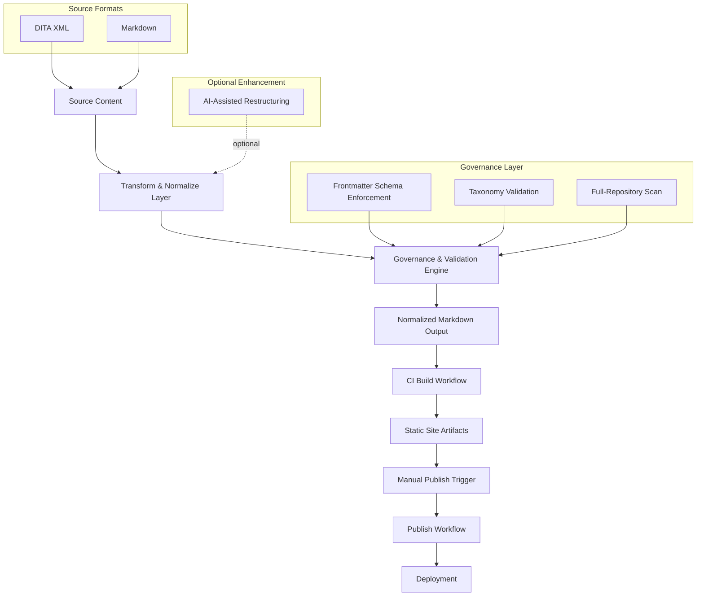

# Portfolio Architecture

## 1. Overview

This documentation platform is intentionally designed as a deterministic, governance-enforced documentation system modeled after enterprise publishing infrastructure.

It demonstrates:

- Structured source ingestion (DITA XML, Markdown)
- Deterministic transformation and normalization layer (Python-based processing)
- Enforced metadata governance (schema + taxonomy validation)
- Full-repository validation gates at build time
- CI/CD automation via GitHub Actions
- Strict separation of build and manual publish
- Static site generation (MkDocs + Material)
- AI-assisted transformation and restructuring layer

The platform separates content processing, validation, and publishing into distinct layers, mirroring enterprise documentation governance models where structural integrity is enforced before release.

## 2. High-Level Architecture

