# Michael Taylor

I build documentation platforms that operate as production infrastructure inside modern engineering organizations.

**Enterprise Knowledge Systems Architect**

Enterprise Knowledge Platform Architect with 15+ years building documentation systems inside cybersecurity and enterprise software organizations.

I design and govern documentation platforms that integrate with engineering CI/CD, enforce metadata standards, and transform documentation into scalable knowledge infrastructure.

**Key areas of focus include:**

• 15+ years building enterprise documentation ecosystems  
• Documentation platforms integrated with engineering CI/CD  
• Docs-as-Code governance and automated publishing pipelines  
• AI-ready structured knowledge architectures

---

## What I Do

My work operates at the intersection of documentation, engineering systems, and platform governance.

• Documentation Platform Architecture  
• Docs-as-Code and CI/CD publishing pipelines  
• Content governance and lifecycle management  
• AI-ready structured content systems  
• Documentation automation and validation frameworks

---

## Selected Work

### [CMS Platform](./projects/cms-platform/cms-platform-overview.md)
Design and implementation of a structured documentation platform integrating Markdown, DITA, validation tooling, and automated publishing pipelines.

### [Sales Library Platform Migration](./projects/sales-library-modernization/slm-sales-library-modernization.md)
Six-month enterprise migration replacing a Salesforce-based sales content library with a SharePoint knowledge platform informed by user research and workflow analysis.

### [Unstructured FrameMaker → DITA XML Pilot](./unstructured-framemaker-dita/unstructured-framemaker-to-dita.md)
Structured content modernization initiative converting legacy unstructured documentation into scalable topic-based DITA architecture.

---

## Documentation Platform Architecture

This portfolio site is itself an example of the documentation platform architecture.

Content can be authored in either DITA XML or Markdown. Source content is processed through a transformation and governance layer that normalizes structure, validates metadata against a controlled taxonomy, and assembles the final documentation corpus. GitHub Actions pipelines enforce validation and build the site using MkDocs, while downstream automation prepares structured metadata for AI knowledge ingestion.

The site is generated using a structured documentation platform that supports:

• Markdown and DITA XML ingestion  
• Metadata governance and taxonomy validation  
• Automated content transformation pipelines  
• CI/CD-controlled publishing workflows  

The architecture, validation tooling, and automation pipelines used to build this site are documented within the [Portfolio Architecture](./architecture/architecture-overview.md) and [Documentation Pipelines](./pipelines/pipeline-overview.md) sections.

---

## How to Read This Portfolio

This portfolio is organized around the architecture of enterprise documentation systems.

• **Portfolio Architecture** – The platform architecture, governance model, and content lifecycle design behind the system. 

[Documentation Systems Portfolio Overview](./architecture/architecture-overview.md)

• **Projects** – Large transformation initiatives including structured content migration and enterprise knowledge platform implementations. 

[CMS Platform](./projects/cms-platform/cms-platform-overview.md) | [Sales Library Platform Migration](./projects/sales-library-modernization/slm-sales-library-modernization.md) | [Unstructured Framemaker → DITA XML Pilot](./unstructured-framemaker-dita/unstructured-framemaker-to-dita.md)

• **Documentation Pipelines** – CI/CD workflows and automation scripts that enforce validation, governance, and reliable publishing. 

[Documentation Pipelines](./pipelines/pipeline-overview.md)

Together these examples demonstrate how documentation platforms can be designed as operational infrastructure rather than content repositories.

---

## Background

I have spent over fifteen years working inside complex technology environments building and governing enterprise documentation ecosystems.

Most of my career has been spent inside cybersecurity product organizations, where documentation systems operate as part of release-critical infrastructure and customer trust frameworks.

My experience spans knowledge platform architecture, documentation operations, release governance, and engineering-integrated publishing systems.

I work closely with engineering, product, and security organizations to ensure documentation platforms support both developer workflows and customer-facing knowledge delivery.

My focus is building systems that make knowledge scalable, reliable, and operationally sustainable.

---

## What you'll find on this site

This portfolio demonstrates how documentation can operate as a production system inside modern engineering environments.

Key areas include:

• Documentation Platform Architecture
  End-to-end systems that manage structured content, metadata governance, and automated publishing pipelines.

• CI/CD Documentation Pipelines  
  Git-based workflows integrating validation, transformation, and automated site generation.

• Content Governance & Validation  
  Taxonomy models, metadata validation systems, and quality controls that ensure consistency at scale.

• Enterprise Content Modernization  
  Real-world migrations from legacy documentation systems into structured, reusable architectures.

• Automation & AI-Ready Knowledge Systems  
  Metadata enrichment pipelines and ingestion preparation for vector databases and AI-driven knowledge platforms.