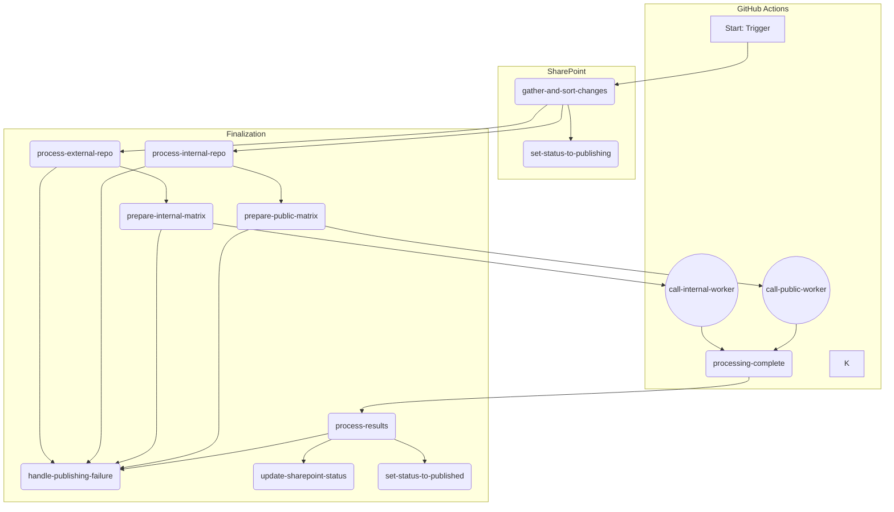

# GitHub KB Article Publishing Workflow

This document details the architecture and process of the automated Knowledge Base (KB) article publishing system. The workflow is orchestrated by GitHub Actions and integrates with SharePoint, Azure Functions, and the Dynamics 365-based Online Help Center (OHC).

The core design is a **parallel, dispatcher-worker model with granular error tracking**. A main dispatcher workflow identifies changes in SharePoint and then triggers other reusable components to process, build, and publish the content.

## I. Architectural Components

The refactored architecture is composed of several modular, reusable components, each with a distinct responsibility.

- **Dispatcher Workflow:** [`elixir-kbarticle-dispatcher.md`](./elixir-kbarticle-dispatcher.md) - The main orchestrator workflow.
- **Repository Processing:** [`process-kb-repo.md`](./process-kb-repo.md) - A reusable workflow for preparing content repositories.
- **Publication Worker:** [`elixir-kbarticle-publish-worker.md`](./elixir-kbarticle-publish-worker.md) - The reusable DITA-OT publication engine.
- **Summary & Sync:** [`reusable-summarize-and-sync.md`](./reusable-summarize-and-sync.md) - A reusable workflow for post-publication summary and synchronization.
- **MET File Generation:** [`create-kb-met.md`](./create-kb-met.md) - A Go utility to create metadata files for the DITA-OT process.
- **MS Graph Authentication:** `get-graph-token/action.yml` - A composite action for acquiring a Microsoft Graph API token. *(Documentation pending)*
- **Article Processing Script:** `process-articles.sh` - The core shell script for converting and processing articles. *(Documentation pending)*

## II. High-Level Workflow Diagram

## III. Authentication

The workflow utilizes two primary methods of authentication:

1.  **Microsoft Graph API:** All interactions with SharePoint (reading lists, updating item statuses) are authenticated using an Azure AD service principal (client ID/secret), which is used by the `get-graph-token` composite action to fetch a bearer token.
2.  **GitHub API and Git Operations:** All cross-repository `git` operations (e.g., checking out the content repositories and pushing changes back) are authenticated using a single, centrally managed service account token stored in the `HIE_SERVICE_GITHUB_TOKEN` organization secret.
