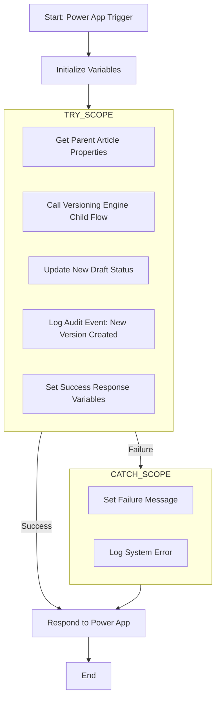

# Design Doc: Instant - Create New Article Version

## 1. Overview

This document details the design for the `Instant - Create New Article Version` Power Automate flow. This flow is responsible for creating a new, editable draft version of a published article. It is a key component of the article versioning system.

This flow is designed to be called from a Power App and leverages a centralized child flow ([`KB-ID-Generator-Child`](./KB_ID_Generator_Child.md)) to handle the core logic of creating the new list item and generating the appropriate version numbers and IDs.

## 2. Workflow and Process Design (V2 - Standardized Logging)

This V2 design refactors the workflow to align with the system's standardized logging and error handling architecture. It introduces a `Try/Catch` block, standardized response variables, and explicit calls to the centralized logging child flows.



### 2.1. Trigger: PowerApps (V2)

*   **Purpose:** To allow the Power App to initiate this workflow directly and pass all required information.
*   **Inputs:**
    *   `parentItemID` (Number, Required): The SharePoint `ID` of the published article to be versioned.
    *   `modifiedBy` (Text, Required): The UPN/email of the user creating the new version. This is critical for ensuring the user audit log accurately reflects who performed the action.

### 2.2. Initialize Variables

*   **Purpose:** To establish a standardized response structure and default to a failure state. This is a security best practice; the flow must explicitly succeed to change these values.
*   **Action 1: Initialize `responseStatus`**
    *   **Type:** `String`
    *   **Value:** `Failure`
*   **Action 2: Initialize `responseMessage`**
    *   **Type:** `String`
    *   **Value:** `An unknown error occurred while creating the new version.`
*   **Action 3: Initialize `newDraftURL`**
    *   **Type:** `String`
    *   **Value:** (leave blank)

### 2.3. Try (Scope)

*   **Purpose:** This scope contains all the core business logic. If any action within it fails, execution immediately stops and is transferred to the `Catch` block.

*   **Action 1: Get Parent Article Properties**
    *   **Action:** `Get item` (SharePoint)
    *   **Purpose:** To retrieve the full record of the published article that will serve as the template for the new version.
    *   **Id:** `parentItemID` from the trigger.

*   **Action 2: Call Versioning Engine Child Flow**
    *   **Action:** `Run a Child Flow`
    *   **Purpose:** To delegate the core, complex logic of creating the new SharePoint item and generating its unique version numbers and IDs to a centralized, reusable child flow.
    *   **Child Flow:** `KB-ID-Generator-Child`
    *   **Parameters:**
        *   `Mode`: `version`
        *   `CanonicalArticleId`: `CanonicalArticleID` from the `Get Parent Article Properties` step.
        *   `Language`: `Language Value` from the `Get Parent Article Properties` step.
        *   `ArticleVersion`: `""` (leave empty)
        *   `ParentItemID`: `ID` from the `Get Parent Article Properties` step.
        *   `ArticlePayload`: `{}` (empty JSON object)

*   **Action 3: Update New Draft Status**
    *   **Action:** `Update item` (SharePoint)
    *   **Purpose:** To explicitly set the status of the newly created item to "Draft".
    *   **Id:** `body('Call_Versioning_Engine_Child_Flow')?['newitemid']`
    *   **Status Value:** `Draft`

*   **Action 4: Log Audit Event**
    *   **Action:** `Run a Child Flow`
    *   **Purpose:** To create a permanent, user-facing record of this business event in the `ArticleAuditLogs` table.
    *   **Flow:** `Instant - LogAuditEvent`
    *   **Parameters:**
        *   `action` (Text): `New Version Created`
        *   `modifiedBy` (Text): `triggerBody()?['text']`
        *   `canonicalArticleId` (Text): `outputs('Get_Parent_Article_Properties')?['body/CanonicalArticleID']`
        *   `articleVersion` (Number): `outputs('Call_Versioning_Engine_Child_Flow')?['newarticleversion']`
        *   `details` (Text): `User created a new draft version of an article (@{outputs('Get_Parent_Article_Properties')?['body/CanonicalArticleID']} v@{outputs('Call_Versioning_Engine_Child_Flow')?['newarticleversion']}) from the latest available version.`
        *   `contentDiff` (Text): (leave blank)

*   **Action 5: Set Success Response Variables**
    *   **Purpose:** To update the response variables to reflect the successful completion of all actions in the `Try` block.
    *   **Actions:**
        *   `Set variable` (`responseStatus` to `Success`)
        *   `Set variable` (`responseMessage` to `New draft created successfully.`)
        *   `Set variable` (`newDraftURL` to `body('Call_Versioning_Engine_Child_Flow')?['newitemurl']`)

### 2.4. Catch (Scope)

*   **Purpose:** This scope acts as a centralized error handler. It only runs if any action in the `Try` scope fails.
*   **Configure run after:** Must be configured to run only when the `Try` scope `has failed`.
*   **Inside the Catch Scope:**
    *   **Action 1: Set Failure Message**
        *   **Action:** `Set variable`
        *   **Purpose:** To capture the specific system error message from the failed step in the `Try` block and prepare it for logging and response.
        *   **Name:** `responseMessage`
        *   **Value:** `An error occurred while creating the new version. Error: @{result('Try')[0]?['error']?['message']}`
    *   **Action 2: Log System Error**
        *   **Action:** `Run a Child Flow`
        *   **Purpose:** To write a detailed, structured error log to the `SystemActivityLogs` table for administrative review.
        *   **Flow:** `Child Flow - LogSystemEvent`
        *   **Parameters:**
            *   `logLevel`: `Error`
            *   `source`: `Instant - Create New Article Version`
            *   `message`: `variables('responseMessage')`
            *   `context`: A JSON object containing the initial trigger parameters for easier debugging.
                ```json
                {
                  "parentItemID": "@{triggerBody()?['number']}",
                  "modifiedBy": "@{triggerBody()?['text']}"
                }
                ```

### 2.5. Respond to Power App

*   **Purpose:** This single, final action sends a standardized response back to the calling Power App. Its configuration ensures it runs regardless of whether the `Try` block succeeded or the `Catch` block was executed.
*   **Configure run after:** Must be configured to run after the `Catch` scope `is successful` OR `is skipped`.
*   **Action:** `Respond to a PowerApp or flow`
*   **Outputs:**
    *   `responseStatus` (Text): `variables('responseStatus')`
    *   `responseMessage` (Text): `variables('responseMessage')`
    *   `newDraftURL` (Text): `variables('newDraftURL')`
