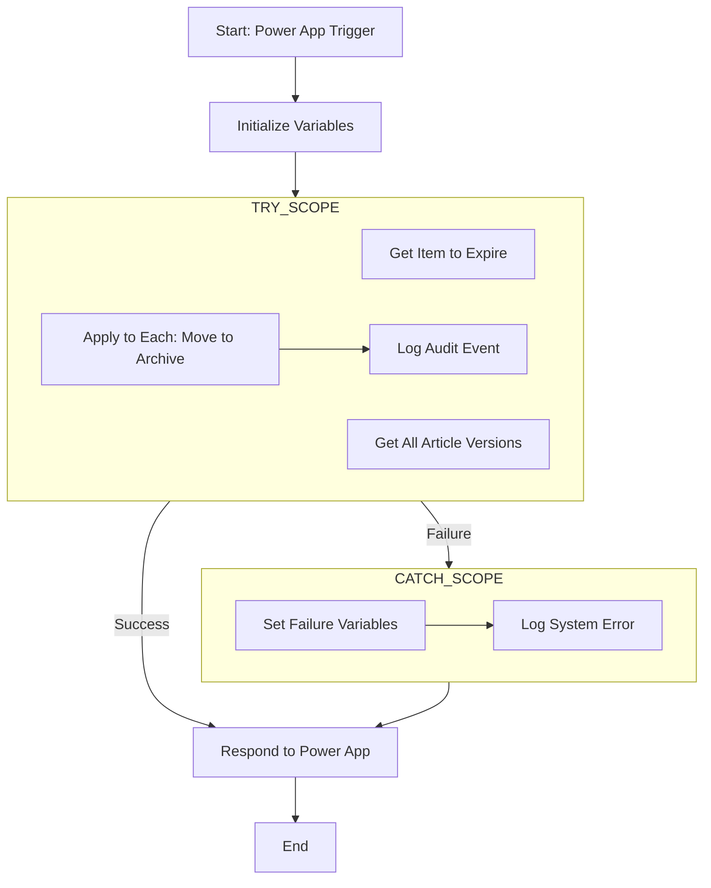

# Article Archive Feature

## Overview

This document is the definitive technical guide for the **Instant Article Expiration** feature. It details the architecture and step-by-step implementation of the Power Automate workflow responsible for archiving articles on demand, including its robust error handling and reporting capabilities.

This feature provides users with an "Expire Now" button within the main Power App. When triggered, this button initiates a workflow that moves an article and its entire version history from the active SharePoint list to the archive list.

## High-Level Power App Integration

The expiration process is initiated from the "Knowledge Base Manager" Power App. A user with appropriate permissions can select a published article and click the "Expire Now" button.

The button's logic does not call the workflow directly. Instead, it uses the app's reusable confirmation dialog to ensure the user understands the significance of this action. Only after the user confirms their choice does the dialog's logic proceed to call the `Instant - Expire Single KB Article` Power Automate flow.

This pattern provides a safe and consistent user experience for all destructive or significant actions within the application. For the specific Power Fx formulas and implementation details of the button and confirmation dialog within the app, please refer to the **`PowerApp_Standalone_DesignDoc.md`**.

## Power Automate Workflow: `Instant - Expire Single KB Article`

This workflow is the engine of the instant expiration feature. It is designed to be robust, reliable, and provide clear feedback to the calling application in the event of either success or failure.

### Workflow Architecture: Try/Catch

To ensure robust error handling, the workflow is built using a `Try/Catch` pattern implemented with **Scope** controls. This is a more streamlined and efficient approach than a traditional three-scope `Try/Catch/Finally` block.

*   **`Try` Scope:** Contains all the primary actions required to archive the article. If any action within this block fails, the entire block stops, and control is passed to the `Catch` block.
*   **`Catch` Scope:** This block only runs if an action in the `Try` scope fails. Its sole purpose is to "catch" the error details and prepare a structured error message.
*   **Final Response Action:** A single `Respond to a PowerApp or flow` action is placed *after* both the `Try` and `Catch` scopes. It is configured to run regardless of which path was taken, ensuring the app always receives a response.



### Detailed Implementation Steps

#### Step 1: Trigger

*   **Action:** `When Power Apps calls a flow` (PowerApps V2 Trigger)
*   **Inputs:**
    *   **`articleID`** (Number): The SharePoint ID of the article to expire. **Must be Required.**
    *   **`modifiedBy`** (Text): The UPN/email of the user performing the action. **Must be Required.**

#### Step 2: Initialize Variables

Immediately after the trigger, add two **`Initialize variable`** actions. These will hold the structured response that will be sent back to the Power App.

1.  **Response Status Variable:**
    *   **Name:** `vResponseStatus`
    *   **Type:** `String`
    *   **Initial Value:** `Success` (The flow assumes success unless an error is caught).
2.  **Response Message Variable:**
    *   **Name:** `vResponseMessage`
    *   **Type:** `String`
    *   **Initial Value:** `The article and its entire version history have been successfully archived.`

#### Step 3: The `Try` Scope

1.  Add a **`Scope`** control and rename it to `Try`.
2.  Place the following actions *inside* the `Try` scope.

    *   **Action 1: `GetItemToExpire`**
        *   **Action Type:** `Get item` (SharePoint)
        *   **Purpose:** To retrieve the full details of the specific article the user clicked on.
        *   **Site Address:** `[Your SharePoint Site]`
        *   **List Name:** `Knowledge Base Articles`
        *   **Id:** Use the `articleID` from the trigger.

    *   **Action 2: `Get all article versions`**
        *   **Action Type:** `Get items` (SharePoint)
        *   **Purpose:** To find every version of the article (including the one retrieved above) so the entire history can be archived.
        *   **Site Address:** `[Your SharePoint Site]`
        *   **List Name:** `Knowledge Base Articles`
        *   **Filter Query:** `CanonicalArticleID eq '@{outputs('GetItemToExpire')?['body/CanonicalArticleID']}'`
            *   *This is the crucial step. It uses the `CanonicalArticleID` from the item found in the previous step to query the list for all items belonging to the same version group.*

    *   **Action 3: `Apply to each version`**
        *   **Action Type:** `Apply to each`
        *   **Input:** `value` from the `Get all article versions` action.
        *   **Purpose:** This loop iterates through every version found and performs the move operation.
        *   **Inside the Loop:** The loop contains four actions to handle the archival of each version. The `Select` actions are a critical best practice for handling complex column types.
        
            1.  **`Select - Clean Contributors`** (`Select` - Data Operation)
                *   **Purpose:** To transform the complex `Contributors` Person column (which is an array of objects) into a simplified array of claims that the `Create item` action can understand.
                *   **From:** `items('Apply_to_each_version')?['Contributors']`
                *   **Map:** In the map, switch to text mode and create a single key-value pair:
                    *   Key: `Claims`
                    *   Value: `@{item()?['Claims']}`
        
            2.  **`Select - Clean Source`** (`Select` - Data Operation)
                *   **Purpose:** To transform the complex `Source` Choice column into a simplified array of values.
                *   **From:** `items('Apply_to_each_version')?['Source']`
                *   **Map:** In the map, switch to text mode and create a single key-value pair:
                    *   Key: `Value`
                    *   Value: `@{item()?['Value']}`
        
            3.  **`CreateArchiveRecord`** (`Create item` - SharePoint)
                *   **Purpose:** Creates a copy of the current version in the archive list.
                *   **Site Address:** `[Your SharePoint Site]`
                *   **List Name:** `Knowledge Base Articles Archive`
                *   **Item Data:** Map all simple fields (like Text, Number, Date) directly from the current loop item (`items('Apply_to_each_version')`). For the `Contributors` and `Source` fields, you must switch to "Input entire array" mode and use the **Output** from the corresponding `Select` action above (`Select - Clean Contributors` and `Select - Clean Source` respectively).
        
            4.  **`DeleteCurrentRecord`** (`Delete item` - SharePoint)
                *   **Purpose:** Removes the original version from the active list after it has been successfully copied to the archive.
                *   **Site Address:** `[Your SharePoint Site]`
                *   **List Name:** `Knowledge Base Articles`
                *   **Id:** Use the `ID` from the current loop item (`items('Apply_to_each_version')?['ID']`).

    *   **Action 4: `Log Article Expired Event`**
        *   **Action Type:** `Run a Child Flow`
        *   **Flow:** `Instant - LogAuditEvent`
        *   **Parameters:**
            *   `action` (Text): `Article Expired`
            *   `modifiedBy` (Text): `triggerBody()?['text']`
            *   `canonicalArticleId` (Text): `outputs('GetItemToExpire')?['body/CanonicalArticleID']`
            *   `articleVersion` (Number): `outputs('GetItemToExpire')?['body/ArticleVersion']`
            *   `details` (Text): `User expired an article (@{outputs('GetItemToExpire')?['body/CanonicalArticleID']}) and its entire version history.`
            *   `contentDiff` (Text): (leave blank)

#### Step 4: The `Catch` Scope

1.  Add a new **`Scope`** control *after* the `Try` scope and rename it to `Catch`.
2.  Click the `...` menu on the `Catch` scope and select **`Configure run after`**.
3.  Check the boxes for **`has failed`**, **`is skipped`**, and **`has timed out`**. Uncheck `is successful`. Click **Done**.
4.  Place the following actions *inside* the `Catch` scope.

    *   **Action 1: `Set vResponseStatus to Failure`**
        *   **Action Type:** `Set variable`
        *   **Name:** `vResponseStatus`
        *   **Value:** `Failed`

    *   **Action 2: `Set vResponseMessage with Error`**
        *   **Action Type:** `Set variable`
        *   **Name:** `vResponseMessage`
        *   **Value:** `An error occurred while expiring the article. Please contact support. Error: @{result('Try')[0]?['error']?['message']}`

    *   **Action 3: `Log System Error`**
        *   **Action Type:** `Run a Child Flow`
        *   **Flow:** `Child Flow - LogSystemEvent`
        *   **Parameters (Standardized Schema):**
            *   `logLevel` (Text): `Error`
            *   `source` (Text): `Instant - Expire Single KB Article v2`
            *   `message` (Text): `variables('vResponseMessage')`
            *   `context` (Text):
                ```json
                {
                  "articleID": "@{triggerBody()?['number']}",
                  "modifiedBy": "@{triggerBody()?['text']}"
                }
                ```

#### Step 5: Respond to Power App

This is the final and most critical action. It must be placed *after* the `Catch` scope, not inside any scope.

1.  Add the **`Respond to a PowerApp or flow`** action.
2.  Click the `...` menu on this action and select **`Configure run after`**.
3.  The `Configure run after` settings are critical. You must ensure this action runs after *either* the `Try` scope (on success) or the `Catch` scope (on any outcome).
4.  The final configuration should look like this:
    *   The `Try` scope's **`is successful`** box must be checked.
    *   The `Catch` scope's **`is successful`**, **`has failed`**, **`is skipped`**, and **`has timed out`** boxes must all be checked.
5.  This configuration ensures that this action will *always* run, regardless of whether the `Try` block succeeded or the `Catch` block ran, making it a more efficient replacement for a `Finally` scope.

*   **Action: `Respond to a PowerApp or flow`**
    *   **Purpose:** This action sends the final structured response back to the Power App and forces the app to wait for the flow to complete.
    *   **Outputs:** Add two **Text** outputs:
        1.  **Name:** `responseStatus`
            *   **Value:** Select the `vResponseStatus` variable from dynamic content.
        2.  **Name:** `responseMessage`
            *   **Value:** Select the `vResponseMessage` variable from dynamic content.

## Power App Response Handling

With the workflow updated, the Power App must be configured to interpret the structured response. The `OnSelect` formula for the confirmation dialog's "Confirm" button should call the flow and then use an `If` statement to check the `responseStatus` field of the returned record.

*   If `responseStatus` is "Success", the app should proceed with refreshing its data source and resetting the UI.
*   If `responseStatus` is "Failure", the app should display the `responseMessage` to the user in an error notification, allowing them to see the specific error caught by the flow.

For the exact Power Fx implementation of this logic, refer to the **`PowerApp_Standalone_DesignDoc.md`**.
