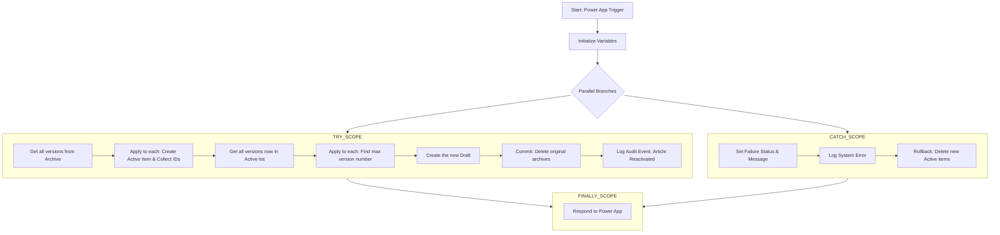

# Design Doc: Archived Article Reactivation

## 1. Overview

This document details the design for the feature that allows a user to restore an article's entire version history from the "Knowledge Base Articles Archive" back to the active "Knowledge Articles" list. The process culminates in the creation of a new, editable draft.

## 2. Feature Requirements

1.  **Transactional Restoration**: The entire restoration process must be managed as a single operation.
2.  **Full History Migration**: All versions of an article associated with a given `CanonicalArticleID` must be moved from the archive to the active list.
3.  **New Draft Creation**: After the move, a new draft version must be created based on the content of the most recent of the restored versions.
4.  **Integrity**: The `IsLatestVersion` flag must be correctly managed, with the new draft being the only version marked as the latest.

## 3. Triggering Mechanism

This workflow is designed to be triggered from the **Knowledge Base Manager Power App**. The app is responsible for all user interface elements and logic related to initiating the reactivation process.

*   **Trigger Type**: `PowerApps (V2)`
*   **Input Parameters**: The app must pass two text parameters:
    *   `in_CanonicalArticleID`: The unique identifier for the article family to be reactivated.
    *   `in_ModifiedBy`: The UPN/email of the user performing the action.

For a comprehensive guide on the front-end implementation, including the UI controls, state variables, and the specific Power Fx formulas used to call this flow, please see the [Archived History Management UI Design Doc](../../power-app-design/power-app-features/ArchivedHistoryManagement.md).

## 4. Power Automate Workflow: `Instant - Reactivate Archived Article`

This flow handles the complex, multi-step process of restoring an article and its history. It is designed to be transactional and resilient, providing clear success or failure feedback to the Power App.

### 4.1. High-Level Logic with Error Handling

The flow is structured using a **Try, Catch, Finally** pattern to ensure that it always responds to the Power App, even if an error occurs.

*   **Try**: This block contains all the core business logic: moving items from the archive, finding the latest version, and creating the new draft.
*   **Catch**: This block runs only if any action within the Try block fails. Its sole purpose is to capture the failure and set a status variable to "Error".
*   **Finally**: This block runs regardless of whether the Try or Catch block executed. It contains the final `Respond to a PowerApp` action, sending back the value of the status variable.

### 4.2. Visual Flow Diagram



### 4.3. Detailed Implementation Guide

This guide provides a step-by-step walkthrough for building the flow from scratch.

**Step 1: Trigger & Initial Variables**

1.  **Trigger**: `When Power Apps calls a flow (V2)`
    *   **Inputs**:
        *   Add a `Text` input named `in_CanonicalArticleID`.
        *   Add a `Text` input named `in_ModifiedBy`.
2.  **Action**: `Initialize variable`
    *   **Name**: `varRestoredLatestContent`
    *   **Type**: `Object`
    *   **Value**: `{}` (leave as an empty JSON object)
3.  **Action**: `Initialize variable` - *Initialize statusmessage*
    *   **Name**: `statusmessage`
    *   **Type**: `String`
    *   **Value**: `"The article has been successfully re-activated."`
4.  **Action**: `Initialize variable`
    *   **Name**: `varFlowStatus`
    *   **Type**: `String`
    *   **Value**: `Success`
5.  **Action**: `Initialize variable`
    *   **Name**: `varMaxVersion`
    *   **Type**: `Integer`
    *   **Value**: `0`
6.  **Action**: `Initialize variable` - *For Commit*
    *   **Name**: `arrArchiveIDsToDelete`
    *   **Type**: `Array`
7.  **Action**: `Initialize variable` - *For Rollback*
    *   **Name**: `arrActiveIDsToRollback`
    *   **Type**: `Array`

**Step 2: The TRY Scope**

1.  Add a new **Scope** control. Rename it `TRY`.
2.  Place all the following actions *inside* the `TRY` scope.

    *   **Action**: `Get items` - *Get all versions to be moved*
        *   **Site Address**: Knowledge Base Hub
        *   **List Name**: `Knowledge Base Articles Archive`
        *   **Filter Query**: `CanonicalArticleID eq '@{triggerBody()['text']}'`

    *   **Action**: `Apply to each` - *Move all versions from Archive to Active*
        *   **Select an output from previous steps**: `value` from the *Get all versions to be moved* action.
        *   **Inside the loop**:
            1.  **Action**: `Select` - *Re-shape Source field array*
                *   **From**: `@items('Move_all_versions_from_Archive_to_Active')?['Source']`
                *   **Map**: Switch to text mode and enter `{"Value": "@{item()?['Value']}"}`.
            2.  **Action**: `Select` - *Re-shape Contributors field array*
                *   **From**: `@items('Move_all_versions_from_Archive_to_Active')?['Contributors']`
                *   **Map**: Switch to text mode and enter `{"Claims": "@{item()?['Claims']}"}`. This is the same pattern as for the Source field, but for a multi-select Person column, we need the Claims value.
            3.  **Action**: `Create item` - *Create item in Active list*
                *   **Site Address**: Knowledge Base Hub
                *   **List Name**: `Knowledge Base Articles`
                *   **Item Data**: Map all corresponding fields from the `items('Move_all_versions_from_Archive_to_Active')` object, with these crucial overrides:
                    *   **Source**: Use the **Output** from the `Select - Re-shape Source field array` action.
                    *   **Contributors**: Use the **Output** from the `Select - Re-shape Contributors field array` action.
                    *   **IsLatestVersion**: Set to `No`.
                *   See **Section 4.4** for details on mapping other complex fields.
            2.  **Action**: `Append to array variable` - *Collect Archive ID for commit*
                *   **Name**: `arrArchiveIDsToDelete`
                *   **Value**: `@items('Move_all_versions_from_Archive_to_Active')?['ID']`
            3.  **Action**: `Append to array variable` - *Collect Active ID for rollback*
                *   **Name**: `arrActiveIDsToRollback`
                *   **Value**: `@outputs('Create_item_in_Active_list')?['body/ID']`
            4.  **Action**: `Condition` - *Find latestVersion*
                *   **Choose a value**: `items('Apply_to_each')?['IsLatestVersion']`
                *   **Condition**: `is equal to`
                *   **Choose a value**: `true` (the expression, not the string)
                *   **If yes**:
                    *   **Action**: `Set variable` - *Store latestVersion for new draft*
                        *   **Name**: `varRestoredLatestContent`
                        *   **Value**: `items('Apply_to_each')`

    *   **Action**: `Get items` - *Get all versions now in active list*
        *   **Site Address**: Knowledge Base Hub
        *   **List Name**: `Knowledge Articles`
        *   **Filter Query**: `CanonicalArticleID eq '@{triggerBody()['text']}'`


    *   **Action**: `Apply to each` - *Find the max version number*
        *   **Select an output from previous steps**: `value` from *Get all versions now in active list*.
        *   **Inside the loop**:
            1.  **Action**: `Compose` - *Determine latestVersionNum*
                *   **Inputs**: `if(greater(int(items('Find_max_version_number')?['ArticleVersion']), variables('varMaxVersion')), int(items('Find_max_version_number')?['ArticleVersion']), variables('varMaxVersion'))`
            2.  **Action**: `Set variable` - *Set varMaxVersion*
                *   **Name**: `varMaxVersion`
                *   **Value**: `outputs('Determine_latestVersionNum')`

    *   **Action**: `Select` - *Re-shape Source for Draft*
        *   **From**: `@variables('varRestoredLatestContent')?['Source']`
        *   **Map**: Switch to text mode and enter `{"Value": "@{item()?['Value']}"}`.
    *   **Action**: `Select` - *Re-shape Contributors for Draft*
        *   **From**: `@variables('varRestoredLatestContent')?['Contributors']`
        *   **Map**: Switch to text mode and enter `{"Claims": "@{item()?['Claims']}"}`.
    *   **Action**: `Create item` - *Create the new Draft*
        *   **Site Address**: Knowledge Base Hub
        *   **List Name**: `Knowledge Articles`
        *   **Item Data**: Map all fields from the `varRestoredLatestContent` variable, with these crucial overrides:
            *   **Source**: Use the **Output** from the `Select - Re-shape Source for Draft` action.
            *   **Contributors**: Use the **Output** from the `Select - Re-shape Contributors for Draft` action.
            *   **Status Value**: `Draft`
            *   **IsLatestVersion**: `Yes`
            *   **ArticleVersion**: `add(variables('varMaxVersion'), 1)`

    *   **Action**: `Apply to each` - *Commit: Delete original archives*
        *   **Select an output from previous steps**: `variables('arrArchiveIDsToDelete')`
        *   **Inside the loop**:
            1.  **Action**: `Delete item`
                *   **Site Address**: Knowledge Base Hub
                *   **List Name**: `Knowledge Base Articles Archive`
                *   **Id**: `@item()`

    *   **Action**: `Run a Child Flow` - *Log Audit Event*
        *   **Flow**: `Instant - LogAuditEvent`
        *   **Parameters**:
            *   `action` (Text): `Article Reactivated`
            *   `modifiedBy` (Text): `triggerBody()?['text_1']`
            *   `canonicalArticleId` (Text): `triggerBody()?['text']`
            *   `articleVersion` (Number): `add(variables('varMaxVersion'), 1)`
            *   `details` (Text): `User reactivated an article (@{triggerBody()?['text']}) from the archive, creating a new draft (version @{add(variables('varMaxVersion'), 1)}).`
            *   `contentDiff` (Text): (leave blank)


**Step 3: The CATCH Scope**

1.  Click the `+` icon *between* the `TRY` scope and the end of the flow, and select **Add a parallel branch**.
2.  In the new branch, add a **Scope** control. Rename it `CATCH`.
3.  Click the `...` on the `CATCH` scope and select **Configure run after**.
4.  Check the boxes for **has failed**, **is skipped**, and **has timed out**. Uncheck **is successful**. Click **Done**.
5.  Inside the `CATCH` scope, add the following actions to capture the specific error details:
    *   **Action 1: Set Failure Status**
        *   **Action**: `Set variable`
        *   **Name**: `varFlowStatus`
        *   **Value**: `Failed`
    *   **Action 2: Set Failure Message**
        *   **Action**: `Set variable`
        *   **Name**: `statusmessage`
        *   **Value**: `An error occurred during reactivation. Please contact support. Error: @{result('TRY')[0]?['error']?['message']}`
    *   **Action 3: Log System Error**
        *   **Action**: `Run a Child Flow`
        *   **Flow**: `Child Flow - LogSystemEvent`
        *   **Parameters (Standardized Schema)**:
            *   `logLevel` (Text): `Error`
            *   `source` (Text): `Instant - Reactivate Archived Article`
            *   `message` (Text): `variables('statusmessage')`
            *   `context` (Text):
                ```json
                {
                  "canonicalArticleID": "@{triggerBody()?['text']}",
                  "modifiedBy": "@{triggerBody()?['text_1']}"
                }
                ```

    *   **Action**: `Apply to each` - *Rollback: Delete partially created active items*
        *   **Select an output from previous steps**: `variables('arrActiveIDsToRollback')`
        *   **Inside the loop**:
            1.  **Action**: `Delete item`
                *   **Site Address**: Knowledge Base Hub
                *   **List Name**: `Knowledge Articles`
                *   **Id**: `@item()`

**Step 4: The FINALLY Scope**

1.  Add a new action *after* the parallel `TRY` and `CATCH` branches converge.
2.  Add a **Scope** control. Rename it `FINALLY`.
3.  Click the `...` on the `FINALLY` scope and select **Configure run after**.
4.  Check **all four** boxes: **is successful**, **has failed**, **is skipped**, and **has timed out**. Click **Done**.
5.  Inside the `FINALLY` scope, add the final response action:
    *   **Action**: `Respond to a PowerApp or flow`
        *   **Add an output**: `Text`
            *   **Name**: `result`
            *   **Value**: `variables('varFlowStatus')`
        *   **Add an output**: `Text`
            *   **Name**: `message`
            *   **Value**: `variables('statusmessage')`

### 4.4. Field Mapping for Create Item Actions

When using the `Create item` action, you must map the fields from the source object (`items('Apply_to_each')` or `variables('varRestoredLatestContent')`) to the new item's columns. For complex SharePoint fields, you must specify which property of the source object to use.

*   **Single-Select Person or Group Fields (e.g., `LastAuthor`, `Created By`)**:
    *   You must provide the `Claims` identifier directly.
    *   **Example for `LastAuthor`**: `variables('varRestoredLatestContent')?['LastAuthor']?['Claims']`

*   **Multi-Select Person or Group Fields (e.g., `Contributors`)**:
    *   You cannot map the array directly. You must first use a `Select` action to transform the array into the correct format, containing only the `Claims` of each person.
    *   See the `Select - Re-shape Contributors field array` action in the main implementation guide for the specific configuration.

*   **Choice Fields (e.g., `Language`, `Status`)**:
    *   You must provide the `Value` property.
    *   **Example for `Language`**: `variables('varRestoredLatestContent')?['Language']?['Value']`

*   **Lookup Fields**:
    *   You must provide the `Id` of the lookup item.
    *   **Example**: `variables('varRestoredLatestContent')?['ProductLookup']?['Id']`

*   **Simple Text, Number, or Date Fields (e.g., `Title`)**:
    *   You can map the value directly.
    *   **Example**: `variables('varRestoredLatestContent')?['Title']`

*   **Multi-Select Choice Fields (e.g., `Source`)**:
    *   You cannot map the array directly. You must first use a `Select` action to transform the array into the correct format, containing only the `Value` of each choice.
    *   See the `Select - Re-shape Source field array` action in the main implementation guide for the specific configuration.

## 5. User Scenario: Restoring an Archived Version

1.  **User Action**: The user, in Archive View, clicks the "Reactivate Article" button on the latest version of an archived article.
2.  **Power App**: The `OnSelect` property shows a confirmation dialog.
3.  **Flow Call**: Upon confirmation, the app calls `'Instant-ReactivateArchivedArticle'.Run(...)`, passing the `CanonicalArticleID`.
4.  **Power Automate (`Instant - Reactivate...`)**:
    *   The flow attempts the entire restoration process within the `TRY` scope.
    *   **If any action fails** (e.g., a SharePoint permission error, an invalid ID), the `TRY` scope stops, and the `CATCH` scope runs, setting `varFlowStatus` to `Error`.
    *   **If all actions succeed**, the `TRY` scope completes, and the `varFlowStatus` remains `Success`.
    *   The `FINALLY` scope runs in either case, returning the final value of `varFlowStatus` to the app.
5.  **Power App**:
    *   The app inspects the `result` from the flow call.
    *   If `Success`, it notifies the user, refreshes the view to show the new draft in the active list, and navigates them to it.
    *   If `Error`, it notifies the user that the operation failed, allowing them to try again or contact support.