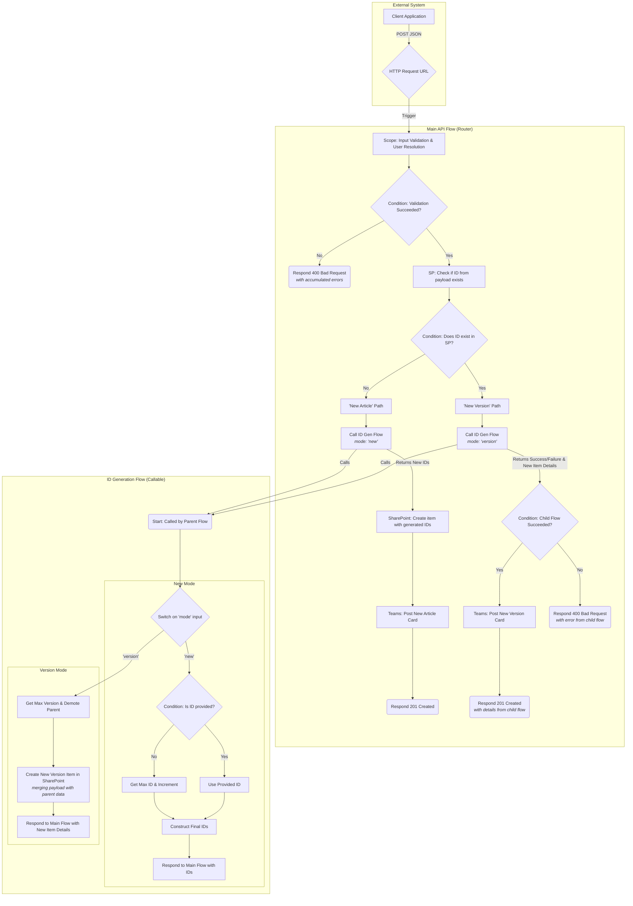

# KB-API-Endpoint

## 1. Executive Summary
This document outlines the V3 architecture for the KB Article Creation API. This version simplifies the process by removing the translation logic for a more streamlined Proof of Concept (POC) implementation. The architecture maintains the decoupled design from V2, using a main API flow to route requests and a callable child flow for complex ID generation and versioning logic.

The V3 design consists of two Power Automate flows:
1.  **Main API Flow (Router):** The public-facing HTTP endpoint. It validates the incoming request and routes it based on whether it's a new article or a new version.
2.  **ID Generation Flow:** A callable child flow that contains the specific logic to handle either generating IDs for a **new article** or creating a **new version** of an existing article.

Based on the feedback provided, the responsibility for item creation is now split:
- **New Articles (`mode: 'new'`)**: The Main API flow will call the child flow to get the next available IDs, then create the item in SharePoint itself.
- **New Versions (`mode: 'version'`)**: The Main API flow will pass the entire request payload to the child flow, which will handle the demotion of the old version and the creation of the new version item.

## 2. V3 Architectural Diagram



## 3. Detailed Logic: Main API Flow (Router)

This flow acts as the public endpoint and is responsible for routing requests to the child flow.

1.  **Trigger:** `When a HTTP request is received`
    *   **Schema:** Use the `KnowledgeArticleSchema.json` to generate the schema for the request body.
    *   **Note on Validation:** The trigger's schema is the primary mechanism for data type validation. If an incoming request provides a value with an incorrect data type (e.g., a number for the `title` field), the flow will automatically fail and respond with a 400 Bad Request. This is the standard and most efficient way to handle type validation.

2.  **Action: Initialize variable - `responseStatusCode`**
    *   **Name:** `responseStatusCode`
    *   **Type:** `Integer`

3.  **Action: Initialize variable - `responseBody`**
    *   **Name:** `responseBody`
    *   **Type:** `String`

4.  **Action: Initialize variable - `validationErrors`**
    *   **Name:** `validationErrors`
    *   **Type:** `Array`
    *   **Value:** `[]`

5.  **Action: Initialize variable - `varResolvedLastAuthor`**
    *   **Name:** `varResolvedLastAuthor`
    *   **Type:** `Object`
    *   **Value:** (leave empty)

6.  **Action: Initialize variable - `varResolvedContributorClaims`**
    *   **Name:** `varResolvedContributorClaims`
    *   **Type:** `Array`
    *   **Value:** `[]`

<!-- Step 7 removed as the 'Get Environment Variable' action is not available in this environment. The Power App URL is hard-coded in the Adaptive Cards in the appendices. -->

7.  **Action: Scope - Input Validation and User Resolution**
    *   **Configure run after:** Default (runs after variables are initialized).
    *   *This scope encapsulates all initial validation for required fields and user existence to ensure the request is valid before processing. It uses parallel branches for efficiency. Data type validation is handled by the trigger's JSON schema.*
    *   **Inside the Scope:**
        1.  **Action: Parallel branch**
            *   *This parallel execution validates non-dependent fields and resolves users simultaneously.*
            *   **Scope - Field and Data Type Validation**
                *   *A series of sequential conditions to check required fields and data types.*
                *   **Action: Condition - Check title**
                    *   **Condition:** `empty(triggerBody()?['title'])` is equal to `true`
                    *   **If Yes:** Append "`Title` is a required field." to `validationErrors`.
                *   **Action: Condition - Check overview**
                    *   **Condition:** `empty(triggerBody()?['overview'])` is equal to `true`
                    *   **If Yes:** Append "`Overview` is a required field." to `validationErrors`.
                *   **Action: Condition - Check articleContent**
                    *   **Condition:** `empty(triggerBody()?['articleContent'])` is equal to `true`
                    *   **If Yes:** Append "`ArticleContent` is a required field." to `validationErrors`.
                *   **Action: Condition - Validate `publishOn` format**
                    *   **Condition:** `not(empty(triggerBody()?['publishOn']))`
                    *   **If Yes:**
                        *   *This block validates that if `publishOn` is provided, it is a valid ISO 8601 date-time string. It uses a try/catch pattern where a failure to format the date indicates an invalid format.*
                        *   **Action: Compose - Try formatting `publishOn`**
                            *   **Inputs:** `formatDateTime(triggerBody()?['publishOn'])`
                        *   **Action: Append to array variable - `validationErrors`**
                            *   **Configure run after:** `Try formatting publishOn` has failed.
                            *   **Value:** "`publishOn` must be a valid ISO 8601 date-time string."
            *   **Scope - User Validation and Resolution**
                *   *This branch uses a robust Try/Catch pattern with Scopes to handle potential failures during user lookups.*
                *   **Action: Condition - Check if lastAuthor is provided**
                    *   **Condition:** `empty(triggerBody()?['lastAuthor'])` is equal to `true`
                    *   **If Yes:**
                        *   **Action: Append to array variable - `validationErrors`**
                            *   **Value:** `LastAuthor is a required field.`
                    *   **If No:**
                        *   **Action: Scope - Try - Resolve LastAuthor**
                            *   *This scope attempts the user lookup and sets the variable on success.*
                            *   **Action: Get user profile (V2) - Resolve LastAuthor**
                                *   **User (UPN):** `triggerBody()?['lastAuthor']`
                            *   **Action: Set variable - `varResolvedLastAuthor`**
                                *   **Name:** `varResolvedLastAuthor`
                                *   **Value:** `outputs('Resolve_LastAuthor')?['body']`
                        *   **Action: Scope - Catch - LastAuthor Failed**
                            *   **Configure run after:** `Try - Resolve LastAuthor` has failed.
                            *   *This scope runs only if any action inside the 'Try' scope fails.*
                            *   **Action: Append to array variable - `validationErrors`**
                                *   **Value:** "The specified `lastAuthor` could not be found: @{triggerBody()?['lastAuthor']}"
                *   **Action: Apply to each - Validate and Resolve Contributors**
                    *   **Select an output:** `coalesce(triggerBody()?['contributors'], json('[]'))`
                    *   **Inside the loop:**
                        *   **Action: Scope - Try - Resolve Contributor**
                            *   **Action: Get user profile - Resolve Contributor**
                                *   **User (UPN):** `item()`
                            *   **Action: Append to array variable - `varResolvedContributorClaims`**
                                *   **Value:** `{"Claims": "i:0#.f|membership|@{outputs('Get_user_profile_-_Resolve_Contributor')?['body/userPrincipalName']}"}`
                        *   **Action: Scope - Catch - Contributor Failed**
                            *   **Configure run after:** `Try - Resolve Contributor` has failed.
                            *   **Action: Append to array variable - `validationErrors`**
                                *   **Value:** `A contributor email could not be resolved: @{item()}`
        2.  **Action: Condition - Final Validation Check**
            *   **Configure run after:** All parallel branches have completed.
            *   **Condition:** `empty(variables('validationErrors'))` is equal to `false`
            *   **If Yes (validation failed somewhere):**
                1.  **Action: Set variable - Set 400 Status**
                    *   **Name:** `responseStatusCode`
                    *   **Value:** `400`
                2.  **Action: Set variable - Set Validation Error Body**
                    *   **Name:** `responseBody`
                    *   **Value:** `json(concat('{"status":"Failed","errors":', string(variables('validationErrors')), '}'))`
                3.  **Action: Terminate**
                    *   **Status:** `Succeeded`

---
*The following actions constitute the main processing logic of the flow. They will only execute if the preceding "Input Validation & User Resolution" scope completes successfully and does not trigger the `Terminate` action.*

8.  **Action: Scope - Sanitize HTML Inputs**
    *   **Configure run after:** `Input Validation & User Resolution` has succeeded.
    *   **Purpose:** This scope runs the three main HTML fields through the `html-sanitizer` function in parallel to clean them before they are used in any subsequent steps. This is a critical step to prevent data corruption from invalid HTML characters or unwanted tags introduced by source systems.
    *   **Inside the Scope:**
        *   **Action: Parallel branch**
            *   **Branch 1: Sanitize `overview`**
                1.  **Action: HTTP - Sanitize `overview`**
                    *   **Method:** `POST`
                    *   **URI:** `[URL of html-sanitizer function]`
                    *   **Headers:** `Content-Type: application/json`
                    *   **Body:**
                        ```json
                        {
                          "html": "@{triggerBody()?['overview']}"
                        }
                        ```
                2.  **Action: Parse JSON - Parse Sanitized `overview`**
                    *   **Content:** `body('HTTP_-_Sanitize_overview')`
                    *   **Schema:**
                        ```json
                        {
                            "type": "object",
                            "properties": {
                                "cleanHtml": {
                                    "type": "string"
                                }
                            }
                        }
                        ```
            *   **Branch 2: Sanitize `articleContent`**
                1.  **Action: HTTP - Sanitize `articleContent`**
                    *   **Method:** `POST`
                    *   **URI:** `[URL of html-sanitizer function]`
                    *   **Headers:** `Content-Type: application/json`
                    *   **Body:**
                        ```json
                        {
                          "html": "@{triggerBody()?['articleContent']}"
                        }
                        ```
                2.  **Action: Parse JSON - Parse Sanitized `articleContent`**
                    *   **Content:** `body('HTTP_-_Sanitize_articleContent')`
                    *   **Schema:**
                        ```json
                        {
                            "type": "object",
                            "properties": {
                                "cleanHtml": {
                                    "type": "string"
                                }
                            }
                        }
                        ```
            *   **Branch 3: Sanitize `internalNotes`**
                1.  **Action: HTTP - Sanitize `internalNotes`**
                    *   **Method:** `POST`
                    *   **URI:** `[URL of html-sanitizer function]`
                    *   **Headers:** `Content-Type: application/json`
                    *   **Body:**
                        ```json
                        {
                          "html": "@{coalesce(triggerBody()?['internalNotes'], '')}"
                        }
                        ```
                2.  **Action: Parse JSON - Parse Sanitized `internalNotes`**
                    *   **Content:** `body('HTTP_-_Sanitize_internalNotes')`
                    *   **Schema:**
                        ```json
                        {
                            "type": "object",
                            "properties": {
                                "cleanHtml": {
                                    "type": "string"
                                }
                            }
                        }
                        ```

9.  **Action: Select - Parse URLs from ContextSource**
    *   **Configure run after:** `Input Validation & User Resolution` has succeeded.
    *   *This action parses the incoming HTML in the `contextSource` field to extract only the URL from any `<a>` tags.*
    *   **From:** `xpath(xml(concat('<div>', coalesce(triggerBody()?['contextSource'], ''), '</div>')), '//a/@href')`
    *   **Map:** `item()['#value']`

10. **Action: Compose - Join Parsed URLs**
    *   **Configure run after:** `Parse URLs from ContextSource` has succeeded.
    *   *This action joins the array of URLs extracted in the previous step into a single string, separated by newlines.*
    *   **Inputs:** `join(body('Parse_URLs_from_ContextSource'), '
')`

11. **Action: Compose - Initialize Payload with Defaults**
    *   **Configure run after:** `Join Parsed URLs` and `Sanitize HTML Inputs` have succeeded.
    *   *This action creates a new JSON object from the trigger body and the sanitized HTML, applying default values to any optional fields that were not provided. All subsequent actions will use this object as the source of truth.*
    *   **Note on Designer Bug:** To bypass a known Power Automate designer bug that can fail when parsing multiple complex dynamic properties, the `contributors` property is initially set to a static empty array `[]`. The real, pre-formatted Claims data is injected in the `Assemble Final SharePoint Payload` step.
    *   **Final Input Structure (for reference):**
        ```json
        {
          "title": "@{triggerBody()?['title']}",
          "overview": "@{body('Parse_Sanitized_overview')?['cleanHtml']}",
          "articleContent": "@{body('Parse_Sanitized_articleContent')?['cleanHtml']}",
          "lastAuthor": "@{variables('varResolvedLastAuthor')?['userPrincipalName']}",
          "metaTitle": "@{coalesce(triggerBody()?['metaTitle'], triggerBody()?['title'])}",
          "metaDescription": "@{coalesce(triggerBody()?['metaDescription'], body('Parse_Sanitized_overview')?['cleanHtml'])}",
          "audience": "@{coalesce(triggerBody()?['audience'], 'Internal')}",
          "productService": "@{coalesce(triggerBody()?['productService'], 'All products/services')}",
          "isPrimary": @{coalesce(triggerBody()?['isPrimary'], true)},
          "language": "@{coalesce(triggerBody()?['language'], 'en-us')}",
          "productVersion": "@{coalesce(triggerBody()?['productVersion'], 'All')}",
          "owningBusinessUnit": "@{coalesce(triggerBody()?['owningBusinessUnit'], 'trendmicro')}",
          "status": "@{coalesce(triggerBody()?['status'], 'Waiting for Reviewer')}",
          "expirationDate": "@{if(empty(triggerBody()?['expirationDate']), addToTime(utcNow(), 5, 'Year'), triggerBody()?['expirationDate'])}",
          "canonicalArticleId": "@{triggerBody()?['canonicalArticleId']}",
          "articleVersion": "@{string(coalesce(triggerBody()?['articleVersion'], 1))}",
          "keywords": @{coalesce(triggerBody()?['keywords'], json('[]'))},
          "solutionType": "@{triggerBody()?['solutionType']}",
          "category": "@{triggerBody()?['category']}",
          "publishOn": "@{if(empty(triggerBody()?['publishOn']), utcNow(), triggerBody()?['publishOn'])}",
          "contributors": [],
          "source": @{coalesce(triggerBody()?['source'], json('[]'))},
          "internalNotes": "@{body('Parse_Sanitized_internalNotes')?['cleanHtml']}",
          "contextSource": "@{outputs('Join_Parsed_URLs')}"
        }
        ```

12. **Action: Select**
    *   **Configure run after:** `Initialize Payload with Defaults` has succeeded.
    *   *This action should be renamed to "Format Source for SharePoint" for clarity.*
    *   **From:** `outputs('Initialize_Payload_with_Defaults')?['source']`
    *   **Map:**
        ```json
        {
          "Value": "@{item()}"
        }
        ```

13. **Action: Compose**
    *   **Configure run after:** `Format Source for SharePoint` has succeeded.
    *   *This action should be renamed to "Assemble Final SharePoint Payload" for clarity.*
    *   **Inputs:** This action constructs the final, SharePoint-ready JSON object. It injects the correctly formatted `contributors` variable here, which successfully bypasses the designer bug in the initialization step.
        ```json
        {
          "title": "@{outputs('Initialize_Payload_with_Defaults')?['title']}",
          "overview": "@{outputs('Initialize_Payload_with_Defaults')?['overview']}",
          "articleContent": "@{outputs('Initialize_Payload_with_Defaults')?['articleContent']}",
          "lastAuthor": "@{outputs('Initialize_Payload_with_Defaults')?['lastAuthor']}",
          "metaTitle": "@{outputs('Initialize_Payload_with_Defaults')?['metaTitle']}",
          "metaDescription": "@{outputs('Initialize_Payload_with_Defaults')?['metaDescription']}",
          "audience": "@{outputs('Initialize_Payload_with_Defaults')?['audience']}",
          "productService": "@{outputs('Initialize_Payload_with_Defaults')?['productService']}",
          "isPrimary": @{outputs('Initialize_Payload_with_Defaults')?['isPrimary']},
          "language": "@{outputs('Initialize_Payload_with_Defaults')?['language']}",
          "productVersion": "@{outputs('Initialize_Payload_with_Defaults')?['productVersion']}",
          "owningBusinessUnit": "@{outputs('Initialize_Payload_with_Defaults')?['owningBusinessUnit']}",
          "status": "@{outputs('Initialize_Payload_with_Defaults')?['status']}",
          "expirationDate": "@{outputs('Initialize_Payload_with_Defaults')?['expirationDate']}",
          "canonicalArticleId": "@{outputs('Initialize_Payload_with_Defaults')?['canonicalArticleId']}",
          "articleVersion": "@{outputs('Initialize_Payload_with_Defaults')?['articleVersion']}",
          "keywords": "@{join(outputs('Initialize_Payload_with_Defaults')?['keywords'], ', ')}",
          "solutionType": "@{outputs('Initialize_Payload_with_Defaults')?['solutionType']}",
          "category": "@{outputs('Initialize_Payload_with_Defaults')?['category']}",
          "publishOn": "@{outputs('Initialize_Payload_with_Defaults')?['publishOn']}",
          "contributors": @{variables('varResolvedContributorClaims')},
          "source": @{body('Format_Source_for_SharePoint')},
          "internalNotes": "@{outputs('Initialize_Payload_with_Defaults')?['internalNotes']}",
          "contextSource": "@{outputs('Initialize_Payload_with_Defaults')?['contextSource']}"
        }
        ```

14. **Action: Scope - Main Logic**
    *   **Configure run after:** `Assemble Final SharePoint Payload` has succeeded.
    *   *This scope block contains the new, more robust routing logic.*
    *   **Inside the Scope:**
        1.  **Action: Get items (SharePoint)**
            *   *This action should be renamed to "SP: Check for existing CanonicalArticleID" for clarity.*
            *   **List Name:** `Knowledge Articles`
            *   **Filter Query:** `CanonicalArticleID eq '@{outputs('Initialize_Payload_with_Defaults')?['canonicalArticleId']}' and field_19 eq '@{outputs('Initialize_Payload_with_Defaults_no_Contributors')?['language']}'`
            *   **Top Count:** `1`
            *   *Note: This action will run even if the incoming `canonicalArticleId` is blank. In that case, the filter query will be `CanonicalArticleID eq ''`, which will correctly return 0 items.*
        2.  **Action: Condition - Is this a New Version request?**
            *   **Condition:** `empty(outputs('SP:_Check_for_existing_CanonicalArticleID')?['body/value'])` is equal to `false`.
            *   *This single condition now correctly implements the desired logic...*
            *   **If Yes (New Version):**
                *   *This branch executes when a valid `canonicalArticleId` was provided and found in SharePoint.*
                1.  **Action: Get items (SharePoint)**
                    *   *This action should be renamed to "SP: Get Latest Version ID for Parent" for clarity.*
                    *   **List Name:** `Knowledge Articles`
                    *   **Filter Query:** `CanonicalArticleID eq '@{outputs('Initialize_Payload_with_Defaults')?['canonicalArticleId']}' and field_19 eq '@{outputs('Initialize_Payload_with_Defaults')?['language']}' and IsLatestVersion eq 1`
                    *   **Top Count:** `1`
                2.  **Action: Run a Child Flow**
                    *   *This action should be renamed to "Call ID Gen Flow (Version)" for clarity.*
                    *   **Flow:** Select the "ID Generation" child flow.
                    *   **`mode`:** `version`
                    *   **`parentItemID`:** `outputs('SP:_Get_Latest_Version_ID_for_Parent')?['body/value'][0]?['ID']`
                    *   **`articlePayload`:** `string(outputs('Assemble_Final_SharePoint_Payload'))`
                3.  **Action: Condition**
                    *   *This action should be renamed to "Did Child Version Flow Succeed?" for clarity.*
                    *   **Condition:** `outputs('Call_ID_Gen_Flow_(Version)')?['body/status']` is equal to `Success`.
                    *   **If Yes:**
                        1.  **Action: Post card in a chat or channel (Microsoft Teams)**
                            *   *This action should be renamed to "Teams: Post New Version Card" for clarity.*
                            *   **Configure run after:** `Call ID Gen Flow (Version)` has succeeded.
                            *   **Purpose:** Posts a public Adaptive Card to the main KM Team channel to notify them that a new version is ready for SME assignment.
                            *   **Post as:** `Flow bot`
                            *   **Post in:** `Channel`
                            *   **Team:** `(kmt_KnowledgeManagementTeamId)` (Environment Variable)
                            *   **Channel:** `(kmt_KnowledgeManagementKBReviewChannelId)` (Environment Variable)
                            *   **Adaptive Card:** (See JSON schema in Appendix D)
                        2.  **Action: Set variable - Set 201 Status from Version**
                            *   **Name:** `responseStatusCode`
                            *   **Value:** `201`
                        3.  **Action: Set variable - Set Success Body from Version**
                            *   **Name:** `responseBody`
                            *   **Value:** `string(outputs('Call_ID_Gen_Flow_(Version)')?['body'])`
                    *   **If No:**
                        1.  **Action: Set variable - Set 400 Status from Version**
                            *   **Name:** `responseStatusCode`
                            *   **Value:** `400`
                        2.  **Action: Set variable - Set Error Body from Version**
                            *   **Name:** `responseBody`
                            *   **Value:** `string(outputs('Call_ID_Gen_Flow_(Version)')?['body'])`
            *   **If No (New Article):**
                *   *This branch executes if `canonicalArticleId` was blank OR was not found in SharePoint.*
                1.  **Action: Run a Child Flow**
                    *   *This action should be renamed to "Call ID Gen Flow (New)" for clarity.*
                    *   **Flow:** Select the "ID Generation" child flow.
                    *   **`mode`:** `new`
                    *   **`language`:** `outputs('Initialize_Payload_with_Defaults')?['language']`
                    *   **`canonicalArticleId`:** `outputs('Initialize_Payload_with_Defaults')?['canonicalArticleId']`
                2.  **Action: Condition**
                    *   *This action should be renamed to "Did Child Flow Succeed?" for clarity.*
                    *   **Condition:** `outputs('Call_ID_Gen_Flow_(New)')?['body/status']` is equal to `Success`.
                    *   **If Yes:**
                        1.  **Action: Create item (SharePoint)**
                            *   *This action should be renamed to "SP Create New KB Article" for clarity.*
                            *   **List Name:** `Knowledge Articles`
                            *   **Field Mappings:** See table below.
                        2.  **Action: Compose - Assemble Override Body**
                            *   **Configure run after:** `SP: Create New KB Article` has succeeded.
                            *   **Purpose:** To create a valid JSON object for the override request, allowing the Power Automate engine to handle character escaping correctly. This prevents "Invalid JSON" errors caused by special characters in the sanitized HTML.
                            *   **Inputs:**
                                ```json
                                {
                                  "__metadata": {
                                    "type": "SP.Data.Knowledge_x0020_Base_x0020_ArticlesListItem"
                                  },
                                  "field_5": "@{outputs('Assemble_Final_SharePoint_Payload')?['overview']}",
                                  "field_20": "@{outputs('Assemble_Final_SharePoint_Payload')?['articleContent']}",
                                  "InternalNotes": "@{outputs('Assemble_Final_SharePoint_Payload')?['internalNotes']}"
                                }
                                ```
                        3.  **Action: `Send an HTTP request to SharePoint` (Rich Text and Plain Text Override)**
                            *   **Configure run after:** `Compose - Assemble Override Body` has succeeded.
                            *   **Purpose:** This action is the definitive fix for SharePoint incorrectly adding wrapper tags. It uses the SharePoint REST API to directly overwrite the specified fields with the clean, sanitized data.
                            *   **Site Address:** `[Your SharePoint Site]`
                            *   **Method:** `POST`
                            *   **Uri:** `_api/web/lists/getbytitle('Knowledge Base Articles')/items(@{outputs('SP_Create_New_KB_Article')?['body/ID']})`
                            *   **Headers:**
                                ```json
                                {
                                  "Content-Type": "application/json;odata=verbose",
                                  "Accept": "application/json;odata=verbose",
                                  "X-HTTP-Method": "MERGE",
                                  "IF-MATCH": "*"
                                }
                                ```
                            *   **Body:** `outputs('Compose_-_Assemble_Override_Body')`
                        4.  **Action: Post card in a chat or channel (Microsoft Teams)**
                            *   *This action should be renamed to "Teams: Post New Article Card" for clarity.*
                            *   **Configure run after:** `SP: Create New KB Article` has succeeded.
                            *   **Purpose:** Posts a public Adaptive Card to the main KM Team channel to notify them that a new article is ready for SME assignment.
                            *   **Post as:** `Flow bot`
                            *   **Post in:** `Channel`
                            *   **Team:** `(kmt_KnowledgeManagementTeamId)` (Environment Variable)
                            *   **Channel:** `(kmt_KnowledgeManagementKBReviewChannelId)` (Environment Variable)
                            *   **Adaptive Card:** (See JSON schema in Appendix C)
                        5.  **Action: Set variable - Set 201 Status from New**
                            *   **Name:** `responseStatusCode`
                            *   **Value:** `201`
                        6.  **Action: Set variable - Set Success Body from New**
                            *   **Name:** `responseBody`
                            *   **Value:** (Construct the success JSON body using outputs from the 'SP: Create New KB Article' step)
                    *   **If No:**
                        1.  **Action: Set variable - Set 400 Status from New**
                            *   **Name:** `responseStatusCode`
                            *   **Value:** `400`
                        2.  **Action: Set variable - Set Error Body from New**
                            *   **Name:** `responseBody`
                            *   **Value:** `string(outputs('Call_ID_Gen_Flow_(New)')?['body'])`

15. **Action: Response**
    *   **Configure run after:** This action must be configured to run after the `Main Logic` scope has completed (i.e., it must run if the scope is successful, has failed, is skipped, or has timed out). It must also run if the `Terminate` action in the validation scope is triggered.
    *   **Status Code:** `variables('responseStatusCode')`
    *   **Headers:** `Content-Type: application/json`
    *   **Body:** `json(variables('responseBody'))`
    *   *Note: The body must be wrapped in the `json()` expression to convert the string variable back into a proper JSON object for the response.*

---
*The SharePoint field mappings for the `Create item` action in the "New Article" path are as follows:*

| SharePoint Field | Expression |
| :--- | :--- |
| **`Article ID`** (`field_3`) | `outputs('Call_ID_Gen_Flow_(New)')?['body/NewArticleID']` |
| **`CanonicalArticleID`** | `outputs('Call_ID_Gen_Flow_(New)')?['body/NewCanonicalArticleID']` |
| **`ArticleVersion`** | `outputs('Call_ID_Gen_Flow_(New)')?['body/NewArticleVersion']` |
| **`IsLatestVersion`** | `Yes` |
| **`LastAuthor`** | `outputs('Assemble_Final_SharePoint_Payload')?['lastAuthor']` |
| **`Contributors`** | `outputs('Assemble_Final_SharePoint_Payload')?['contributors']` |
| **`Source`** | `outputs('Assemble_Final_SharePoint_Payload')?['source']` |
| **`Keywords`** | `outputs('Assemble_Final_SharePoint_Payload')?['keywords']` |
| *... (all other fields)* | `outputs('Assemble_Final_SharePoint_Payload')?['[fieldName]']` |

## 4. Child Flow Responsibilities (`KB-ID-Generator-Child`)

The child flow's logic remains as defined in `KB_ID_Generator_Child_Flow_Design.md`, with the following clear responsibilities for V3:

*   **`mode: 'new'`:**
    *   Receives an optional `canonicalArticleId` from the parent flow.
    *   **If `canonicalArticleId` is provided:** It uses that ID as the base `NewCanonicalArticleID`.
    *   **If `canonicalArticleId` is blank:** It queries the SharePoint lists to find the highest existing `CanonicalArticleID` and increments it to create the `NewCanonicalArticleID`.
    *   In both cases, it then constructs the final `NewArticleID` (e.g., `KA-#######-en-us-v1`) and sets `NewArticleVersion` to `1`.
    *   Returns `status`, `NewArticleID`, `NewCanonicalArticleID`, and `NewArticleVersion` to the parent flow.
    *   **Does NOT create any SharePoint items.**

*   **`mode: 'version'`:**
    *   Receives the `parentItemID` and the full `articlePayload`.
    *   Demotes the parent item by setting `IsLatestVersion` to `No`.
    *   Creates the new version item in SharePoint, merging data from the payload with the parent item's data as a fallback.
    *   Returns `status`, `NewArticleID`, `NewArticleVersion`, `NewItemID`, and `NewItemURL` to the parent flow.

---

## 5.0. Appendix

### Appendix C: Adaptive Card for New Article Notification

- **JSON Schema:**
   ```json
   {
       "type": "AdaptiveCard",
       "$schema": "http://adaptivecards.io/schemas/adaptive-card.json",
       "version": "1.4",
       "body": [
           {
               "type": "TextBlock",
               "text": "New KB Article Ready for Assignment",
               "weight": "Bolder",
               "size": "Medium",
               "color": "Accent"
           },
           {
               "type": "TextBlock",
               "text": "A new knowledge base article has been created via the API and is ready for SME assignment.",
               "wrap": true
           },
           {
               "type": "FactSet",
               "facts": [
                   {
                       "title": "Article ID:",
                       "value": "@{outputs('SP_Create_New_KB_Article')?['body/field_3']}"
                   },
                   {
                       "title": "Title:",
                       "value": "@{outputs('SP_Create_New_KB_Article')?['body/Title']}"
                   },
                   {
                       "title": "Author:",
                       "value": "@{outputs('SP_Create_New_KB_Article')?['body/LastAuthor/DisplayName']}"
                   }
               ]
           }
       ],
       "actions": [
           {
               "type": "Action.OpenUrl",
               "title": "View Article in Power App",
               "url": "@{concat('https://apps.powerapps.com/play/e/6a796a64-8b93-e3d8-9837-7d6a4b43508c/a/ff359c83-d62e-4b89-a659-6454df83cca1', '?tenantId=3e04753a-ae5b-42d4-a86d-d6f05460f9e4&ArticleID=', outputs('SP_Create_New_KB_Article')?['body/field_3'])}"
           }
       ]
   }
   ```

### Appendix D: Adaptive Card for New Article Version Notification

- **JSON Schema:**
   ```json
   {
       "type": "AdaptiveCard",
       "$schema": "http://adaptivecards.io/schemas/adaptive-card.json",
       "version": "1.4",
       "body": [
           {
               "type": "TextBlock",
               "text": "New Article Version Created",
               "weight": "Bolder",
               "size": "Medium",
               "color": "Accent"
           },
           {
               "type": "TextBlock",
               "text": "A new version of a knowledge base article has been created via the API and is ready for SME assignment.",
               "wrap": true
           },
           {
               "type": "FactSet",
               "facts": [
                   {
                       "title": "Article ID:",
                       "value": "@{outputs('Call_ID_Gen_Flow_(Version)')?['body/NewArticleID']}"
                   },
                   {
                       "title": "Title:",
                       "value": "@{outputs('Assemble_Final_SharePoint_Payload')?['title']}"
                   },
                   {
                       "title": "Author:",
                       "value": "@{outputs('Assemble_Final_SharePoint_Payload')?['lastAuthor']}"
                   }
               ]
           }
       ],
       "actions": [
           {
               "type": "Action.OpenUrl",
               "title": "View Article in Power App",
               "url": "@{concat('https://apps.powerapps.com/play/e/6a796a64-8b93-e3d8-9837-7d6a4b43508c/a/ff359c83-d62e-4b89-a659-6454df83cca1', '?tenantId=3e04753a-ae5b-42d4-a86d-d6f05460f9e4&ArticleID=', outputs('Call_ID_Gen_Flow_(Version)')?['body/NewArticleID'])}"
           }
       ]
   }
   ```

