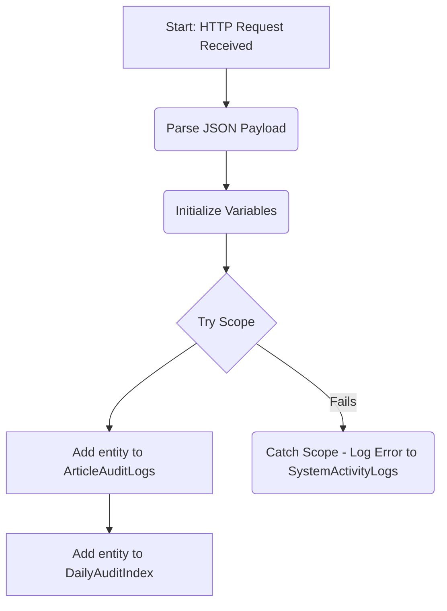

# Design Doc: Instant - LogAuditEvent

## 1. Overview

This document provides the complete specification for the `Instant - LogAuditEvent` Power Automate workflow. This is a centralized, reusable flow designed to be called by other backend workflows. Its sole purpose is to receive a standardized payload and write audit records to the two primary Azure Table Storage tables: `ArticleAuditLogs` and `DailyAuditIndex`.

This flow is critical for decoupling the logging mechanism from the business logic flows.

## 2. Process Flow Diagram

## 3. Detailed Implementation Steps

### 3.1. Trigger: Manually trigger a flow

This trigger is used when a flow is called as a child from a parent flow.

*   **Action:** `Manually trigger a flow`
*   **Inputs:** Define the following inputs, which will become the parameters the parent flow must provide.
    *   `action` (Type: Text)
    *   `modifiedBy` (Type: Text)
    *   `canonicalArticleId` (Type: Text)
    *   `articleVersion` (Type: Number)
    *   `details` (Type: Text)
    *   `contentDiff` (Type: Text)

### 3.2. Add to appConfiguration List

Before building the flow, add the following configuration items to your `appConfiguration` SharePoint list. This makes the flow more maintainable by avoiding hardcoded values.

| Title (Key) | Value |
| :--- | :--- |
| `AUDIT_STORAGE_ACCOUNT_NAME` | `kbauditstorage20260123` |
| `AUDIT_TABLE_ARTICLE_LOGS` | `ArticleAuditLogs` |
| `AUDIT_TABLE_DAILY_INDEX` | `DailyAuditIndex` |

### 3.3. Initialize Variables

First, initialize all the variables you will need for the flow.

*   **Action 1: Initialize `storageAccountName`**
    *   **Type:** `String`
*   **Action 2: Initialize `articleLogTableName`**
    *   **Type:** `String`
*   **Action 3: Initialize `dailyIndexTableName`**
    *   **Type:** `String`
*   **Action 4: Initialize `rowKey`**
    *   **Type:** `String`
    *   **Value:** `@string(sub(ticks('9999-12-31T23:59:59Z'), ticks(utcNow())))`
*   **Action 5: Initialize `partitionKeyDate`**
    *   **Type:** `String`
    *   **Value:** `@utcNow('yyyy-MM-dd')`

### 3.4. Get Configuration from SharePoint & Set Variables

1.  **Action: `Get items` (SharePoint)**
    *   **Name:** `Get_Audit_Configuration`
    *   **Site Address:** Your SharePoint Site
    *   **List Name:** `appConfiguration`
    *   **Filter Query:** `Title eq 'AUDIT_STORAGE_ACCOUNT_NAME' or Title eq 'AUDIT_TABLE_ARTICLE_LOGS' or Title eq 'AUDIT_TABLE_DAILY_INDEX'`

2.  **Action: `Apply to each`**
    *   **Select an output from previous steps:** `@body('Get_Audit_Configuration')?['value']`
    *   **Inside the loop, add a `Switch` action:**
        *   **On:** `@item()?['Title']`
        *   **Case 1:** `AUDIT_STORAGE_ACCOUNT_NAME`
            *   Add a `Set variable` action for `storageAccountName` with value `@item()?['Value']`.
        *   **Case 2:** `AUDIT_TABLE_ARTICLE_LOGS`
            *   Add a `Set variable` action for `articleLogTableName` with value `@item()?['Value']`.
        *   **Case 3:** `AUDIT_TABLE_DAILY_INDEX`
            *   Add a `Set variable` action for `dailyIndexTableName` with value `@item()?['Value']`.

### 3.5. Try (Scope)

This scope contains the core logic. If any action inside it fails, the `Catch` block will execute.

#### 3.5.1. Add Entity to `ArticleAuditLogs`

*   **Action:** `Insert Entity` (Azure Table Storage)
*   **Name:** `Insert_Entity_into_ArticleAuditLogs`
*   **Important:** This action should use the **Connection Reference** configured with your Service Principal.
*   **Storage Account Name:** `@variables('storageAccountName')`
*   **Table Name:** `@variables('articleLogTableName')`
*   **Entity:**
    {
    "PartitionKey": "@{triggerBody()?['text_2']}",
    "RowKey": "@{variables('rowKey')}",
    "Action": "@{triggerBody()?['text']}",
    "ModifiedBy": "@{triggerBody()?['text_1']}",
    "ArticleVersion": "@{triggerBody()?['number']}",
    "Details": "@{triggerBody()?['text_3']}",
    "ContentDiff": "@{triggerBody()?['text_4']}"
    }

#### 3.5.2. Add Entity to `DailyAuditIndex`

*   **Action:** `Insert Entity` (Azure Table Storage)
*   **Name:** `Insert_Entity_into_DailyAuditIndex`
*   **Important:** This action should use the **Connection Reference** configured with your Service Principal.
*   **Storage Account Name:** `@variables('storageAccountName')`
*   **Table Name:** `@variables('dailyIndexTableName')`
*   **Entity:**
{
  "PartitionKey": "@{variables('partitionKeyDate')}",
  "RowKey": "@{variables('rowKey')}",
  "Action": "@{triggerBody()?['text']}",
  "CanonicalArticleID": "@{triggerBody()?['text_2']}",
  "ModifiedBy": "@{triggerBody()?['text_1']}",
  "ArticleVersion": "@{triggerBody()?['number']}"
}

### 3.6. Catch (Scope)

This scope will only execute if any action inside the `Try` scope fails. Its purpose is to call the `Child Flow - LogSystemEvent` to record the failure, creating a resilient, centralized, and maintainable error-logging pattern.

1.  Add a new **`Scope`** action after the `Try` scope and rename it `Catch`.
2.  Click the ellipsis (...) on the `Catch` scope and select **Configure run after**.
3.  Uncheck `is successful` and check the boxes for **`has failed`**, **`is skipped`**, and **`has timed out`**. This ensures the `Catch` block runs for any type of failure in the `Try` block.
4.  Inside the `Catch` scope, add the following action:

    *   **Action:** `Run a Child Flow`
    *   **Name:** `Call_Child_Flow_LogSystemEvent`
    *   **Child Flow:** Select the `Child Flow - LogSystemEvent` flow you just created.
    *   **Parameters:**
        *   `logLevel`: `Error`
        *   `source`: `Instant - LogAuditEvent`
        *   `message`: `Failed to write to ArticleAuditLogs or DailyAuditIndex. Error: @{result('Try')[0]?['error']?['message']}`
        *   `context`: `@{string(triggerBody())}`

**Architectural Explanation:** This is the key to our simplified and secure secret management. By using the `Run a Child Flow` action, we are leveraging the parent flow's existing connection context. The secret for the Service Principal is only stored and managed in the single, shared **Connection Reference** for Azure Table Storage. We do not need to re-authenticate or manage a separate secret in an HTTP action, making the system dramatically easier to maintain.

## 3.7. Final Response Action

As this flow is designed to be called as a child flow from a parent that expects a response, it **must** end with a `Respond to a PowerApp or flow` action. This action signals completion back to the parent flow.

*   **Action:** `Respond to a PowerApp or flow`
*   **Configuration:** This action should be placed at the very end of the flow, after the `Catch` block. It must be configured to run after the `Catch` scope, regardless of whether the `Catch` scope succeeded or was skipped. This is achieved by configuring its "run after" settings to include both `is successful` and `is skipped` for the `Catch` scope.
*   **Outputs:**
    *   `actionStatus` (Text): Set to the static value `Success`.

## 4. Security Considerations

*   **Connection & Authentication:** This flow authenticates to Azure Table Storage using a **Connection Reference**. That reference points to a **Connection** that is configured to use a **Service Principal** (`SharePoint-KB-Publisher-Action`).
    *   The Service Principal must have the `Storage Table Data Contributor` role on the target storage account.
    *   This method ensures that credentials (the client secret) are not stored in the flow definition itself. Refer to the `ServicePrincipal_SharePoint-KB-Publisher-Action.md` document for details on managing the secret.
*   **Trigger Security:** The HTTP trigger should be secured by setting "Who can trigger the flow" to "Any user in my tenant" if possible, or by using a more advanced method like Azure API Management if higher security is required.
