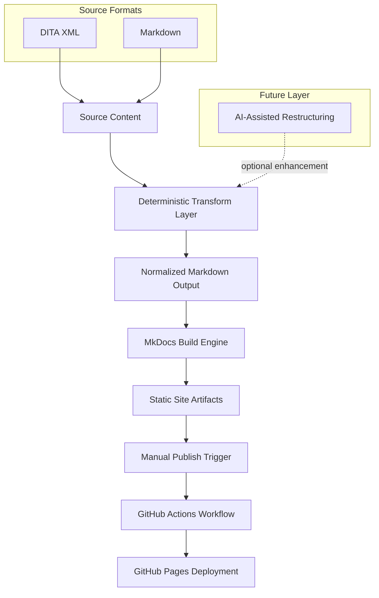

# Portfolio Architecture

## 1. Overview

This documentation platform is intentionally designed as a deterministic, enterprise-style documentation pipeline.

It demonstrates:

- Structured source ingestion (DITA XML, Markdown)
- Deterministic transformation layer (Python-based processing)
- Controlled publishing workflow (manual release trigger)
- Static site generation (MkDocs + Material)
- CI/CD automation via GitHub Actions
- AI-assisted transformation and restructuring layer

The platform separates content processing from publishing, mirroring enterprise documentation governance models.

---

## 2. High-Level Architecture

