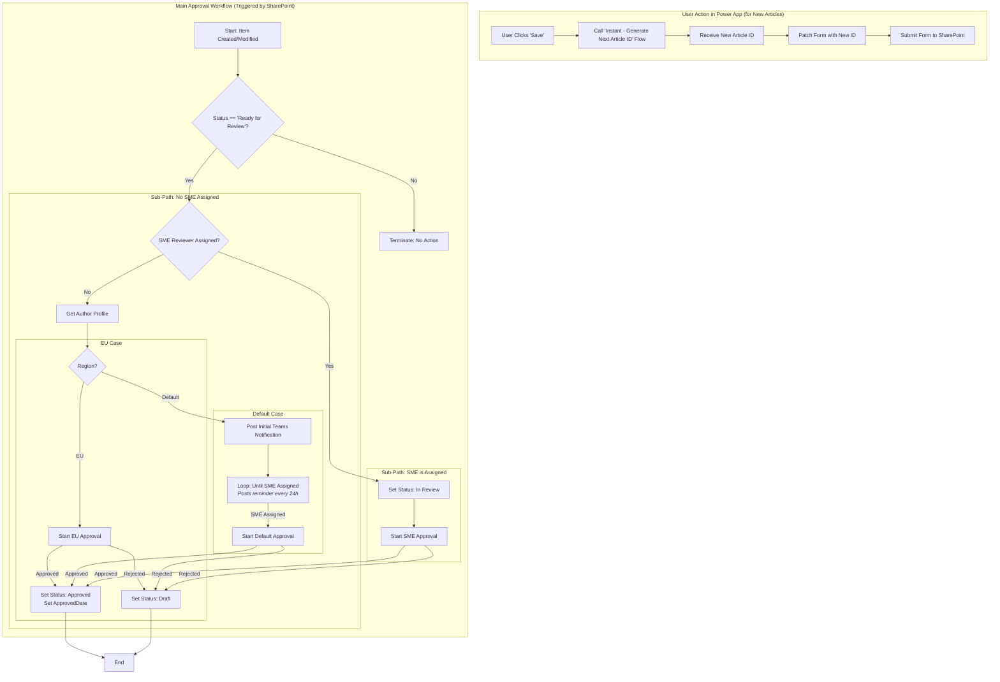
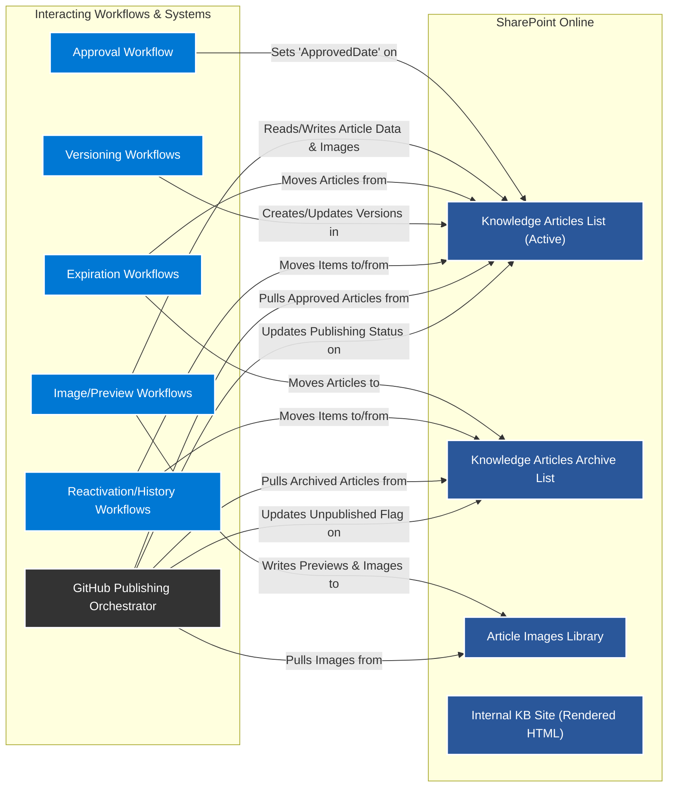
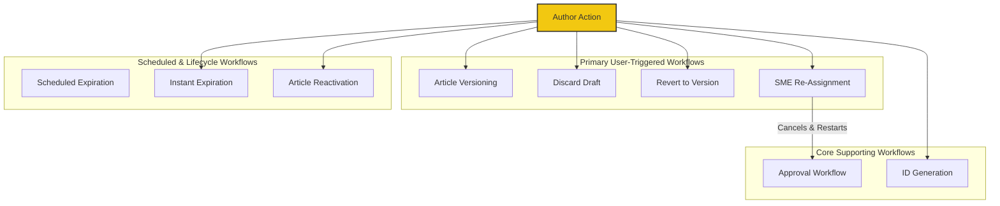
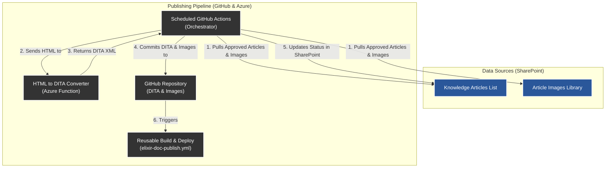
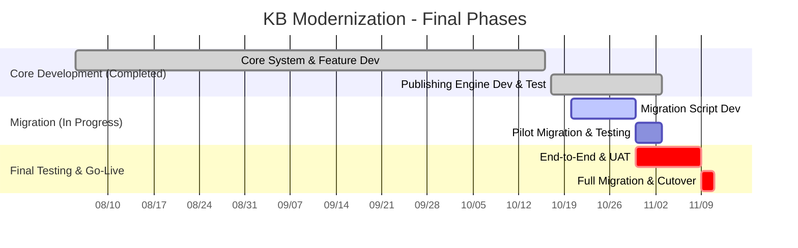

# Enterprise Knowledge Lifecycle Platform – System Architecture

This document describes the as-built technical architecture of the Enterprise Knowledge Lifecycle Platform, including SharePoint schema design, workflow orchestration, publishing integration, and migration strategy.

## 2. SharePoint Site Structure

*   **Site:** "Trend VisionPulse" (SharePoint Communication Site)
*   **Primary List:** "Knowledge Articles"
*   **Archive List:** "Knowledge Base Articles Archive" (Identical schema to the primary list)
*   **Asset Library:** "Article Images" (for images, attachments, and temporary previews)

### Content Type: "Knowledge Article" Metadata

| Column Name | SharePoint Type | Description | Indexed | SharePoint Field ID |
| :--- | :--- | :--- | :--- | :--- |
| **Article ID** | Single line of text | A unique, auto-generated identifier (`KA-#######`). Required and Unique. | **Yes** (Automatic) | field_3 |
| **Status** | Choice | `Draft`, `Ready for Review`, `Waiting for Reviewer`, `In Review`, `Approved`, `Publishing...`, `Published`. | The `Publishing...` status is set by the GitHub workflow during processing. | **Yes** | field_4 |
| **Title** | Single line of text | The main title of the article. | No | Title |
| **Overview** | Multiple lines of text | The summary/user context for the article. | No | field_5 |
| **ArticleContent** | Multiple lines of text | The full HTML content of the article, serving as the source of truth. | No | field_20 |
| **Audience** | Choice | `Internal`, `Public`. | No | field_6 |
| **Author Region** | Choice | `EU`, `Non-EU`. Set automatically by workflow. | No | field_7 |
| **Language** | Choice | `af-za`, `zh-tw`, `en-us`, `ja-jp`. Defaults to `en-us`. | No | field_19 |
| **Assigned SME** | Person or Group | For non-EU reviews, assigned by KM Lead. | No | SMEReviewer |
| **RunningWorkflowID** | Single line of text | A helper field for the re-assignment process. **Only on the active list.** Hidden from users. | No | RunningWorkflowID |
| **ReminderTimestamp** | Date and Time | Stores the timestamp of the last reminder sent. Used by the scheduled reminder workflow to prevent spamming. | No | ReminderTimestamp |
| **PublishingInfo** | Single line of text | A field for the publishing workflow to provide detailed status or error messages. | No | field_9 |
| **Review Comments** | Multiple lines of text | For feedback during the review stage. | No | field_10 |
| **Solution Type** | Choice | `Advisory`, `Vulnerability Solution`, etc. | No | field_11 |
| **Category** | Single line of text | `Troubleshoot`, `Install`, etc. | No | field_12 |
| **Product/Service** | Multiple lines of text | Semicolon-delimited string of products, managed by the Power App from a master list. | No | Product_x002f_Service |
| **Product Version** | Single line of text | To tag associated products. | No | field_13 |
| **Keywords** | Multiple lines of text | For SEO and internal search. | No | field_14 |
| **Publish On** | Date and Time | For scheduled publishing. | No | field_15 |
| **Expiration Date** | Date and Time | The date the article expires. Defaults to 5 years from creation. | **Yes** | field_16 |
| **ApprovedDate** | Date and Time | The date the article was approved. Used by the publishing workflow. | **Yes** | ApprovedDate |
| **PublishedURL** | Hyperlink | Link to the final published article (replaces the old GitHub URL field). | No | field_17 |
| **ArticleVersion** | Number | To track major versions. | No | ArticleVersion |
| **CanonicalArticleID** | Single line of text | The "grouping" ID shared across all versions of an article. | **Yes** | CanonicalArticleID |
| **IsLatestVersion** | Yes/No | A flag to identify the most recent version of an article. | **Yes** | IsLatestVersion |
| **isPrimary** | Yes/No | A flag to identify if this is the primary language version of an article. Used for translation grouping. | **Yes** | isPrimary |
| **SFDC Article Number** | Single line of text | **Crucial.** Preserves the original, unique Salesforce ID for traceability. | No | SFDC_x0020_Article_x0020_Number |
| **Source** | Choice | Stores the team or resource that requested the article. Allows multiple selections. | No | Source |
| **FirstPublishedDate** | Date and Time | Preserves the original first publication date for historical accuracy, separate from the system `Created` date. | No | FirstPublishedDate |
| **Contributors** | Person or Group | Stores the resolved list of contributors from the old system. Allows multiple selections. | No | Contributors |
| **OwningBusinessUnit** | Choice | Stores the owning business unit from the legacy system. | No | OwningBusinessUnit |
| **InternalNotes** | Multiple lines of text | Captures the internal notes associated with the legacy article. | No | InternalNotes |
| **MetaTitle** | Single line of text | Preserves the legacy Meta Title for future business logic. | No | MetaTitle |
| **MetaDescription** | Multiple lines of text | Preserves the legacy Meta Description for future business logic. | No | MetaDescription |
| **ContextSource** | Multiple lines of text | Contains URLs/Article information related to the sources of the material. To be populated post-migration. | No | ContextSource |
| **LastAuthor** | Person or Group | Stores the last known author, whether from migration or API creation, since the system 'Created By' field will reflect the service account. | No | LastAuthor |
| **LegacyCreatedBy** | Single line of text | **Fallback Only.** Stores the original creator name if the user is inactive and cannot be resolved to a Person field during migration. | No | LegacyCreatedBy |
| **LegacyModifiedBy** | Single line of text | Stores the original modifier name if the user is inactive and cannot be resolved during migration. | No | LegacyModifiedBy |
| **LegacyAssignedSME** | Single line of text | Stores the original SME name if the user is inactive and cannot be resolved during migration. | No | LegacyAssignedSME |
| **LegacyContributors** | Multiple lines of text | Stores original contributor names if users are inactive and cannot be resolved during migration. **Set to Plain Text format.** | No | LegacyContributors |
| **Unpublished** | Yes/No | A flag used only in the Archive list to mark an article as fully processed and removed from the public-facing site. Defaults to `No`. | **Yes** | Unpublished |

## 3. Architectural Principles & Constraints

### SharePoint List View Threshold (5,000 Items)

**CRITICAL NOTE:** The "Knowledge Articles" list is expected to contain tens of thousands of items. All future development and enhancements **must** account for the SharePoint List View Threshold of 5,000 items.

*   Any Power Automate flow that uses the `Get items` (plural) action on this list **must** use a filter query on an indexed column to return fewer than 5,000 items.
*   Any new list views created for users **must** be filtered by an indexed column to ensure they do not attempt to display more than 5,000 items at once.
*   Failing to adhere to this will result in failed workflows and unusable list views.

### Schema Synchronization for Archive List

To support long-term performance, expired articles are moved from the primary **`Knowledge Base Articles`** list to a separate **`Knowledge Base Articles Archive`** list.

**CRITICAL NOTE:** These two lists **must** have identical schemas. Any future modification to the columns or content types on the primary list (e.g., adding a new metadata field) **must** be manually replicated on the archive list to ensure the archival process does not fail.

### Article Versioning Strategy

To ensure the integrity of published content, the system uses a "Create a New Item" versioning strategy.

*   **Immutable Publishing:** Once an article's `Status` is `Published`, it is considered locked. No further edits are made to that SharePoint list item.
*   **New Versions:** To edit a published article, a user must trigger the "Create New Version" process. This creates a new, separate list item by duplicating the previous version.
*   **Versioning Columns:**
    *   `CanonicalArticleID`: A new text field that holds the "grouping ID" for all versions of an article (e.g., `KA-0050001`). This ID is used for the stable published URL.
    *   `Article ID`: The existing unique ID field. It is constructed by combining the `CanonicalArticleID`, the `Language` code, and the `ArticleVersion` number (e.g., `KA-0050001-en-us-v2`).
    *   `ArticleVersion`: A new Number field to track the major version (1, 2, 3...).
    *   `IsLatestVersion`: A new Yes/No field indexed for performance. It is `Yes` for the most recent version and `No` for all others. All default list views are filtered on this column.

## 4. Power Automate Workflows

The system is orchestrated by a suite of interconnected Power Automate flows.

### Main Approval Workflow (`KBApprovalProcessWorkflow`)

This diagram represents the as-built approval workflow, including the initial check for an `Article ID`.

### Supporting Workflows
*   **Article ID Generation (`Instant - Generate Next Article ID`):** An on-demand flow called directly by the Power App *before* a new item is saved. It calculates the next sequential `Article ID` by checking both the active and archive lists and returns the new ID to the app.
*   **Image Processing (`Process Article Images`):** An on-demand flow triggered by the Power App to extract Base64 images, save them to SharePoint, and update the HTML with permanent URLs.
*   **HTML Preview (`GenerateHTMLPreview`):** An on-demand flow triggered by the Power App to generate a temporary, styled HTML preview file for authors.
*   **Cleanup (`Temporary File Cleanup`):** A scheduled flow that runs hourly to delete expired preview files.
*   **SME Re-Assignment (`SME_Re-Assignment_Workflow`):** An Instant flow triggered from the Power App to cancel the current approval and restart it with a new SME.
*   **Article Versioning (`Instant - Create New Article Version`):** An on-demand flow triggered by a "Create New Version" button in the Power App. It duplicates a published article into a new draft, increments the version, and sets the appropriate versioning fields.
*   **Discard Draft (`Instant - Discard Article Draft`):** An on-demand flow triggered by a "Discard Draft" button. It deletes the current draft item and updates the previous version to set `IsLatestVersion` back to `Yes`.
*   **Scheduled Article Archival (`Scheduled - Process Expired KB Articles`):** A scheduled flow that runs daily. It finds the latest versions of articles where `ExpirationDate` has passed (regardless of status), then finds and archives **all** related versions of each article, preserving their last-known status in the archive.
*   **Instant Article Archival (`Instant - Expire Single KB Article`):** An on-demand flow triggered by an "Expire Now" button. When triggered on any version of an article, it finds and archives **all** related versions of that article, preserving their last-known status.
*   **Revert to Version (`Instant - Revert To Version`):** An on-demand flow triggered from the version history dialog. It creates a new, sequential draft version (e.g., V4) using the content from a selected historical version (e.g., V2).
*   **Archived Version History (`Get Archived Version History`):** An on-demand flow triggered from the archive's Power App to retrieve the full version history for a selected archived article.
*   **Article Reactivation (`Instant - Reactivate Archived Article`):** An on-demand flow triggered from the archive's Power App. It moves an article's entire version history from the archive list back to the active list and creates a new, sequential draft version for editing.

---

## 5. Content Format and Transformation

*   **Authoring Format:** Authors write and edit articles in a **Rich Text Editor** within a Power App form. The content is saved as HTML.
*   **Transformation Engine:** A scheduled **GitHub Actions workflow** is the sole engine for transformation and publishing. It is not triggered directly by Power Automate.
*   **Process (As-Built):**
    1.  The GitHub Actions workflow runs on a schedule (e.g., every 15 minutes).
    2.  **Gather Changes:** The workflow performs two parallel queries against the SharePoint Graph API:
        *   **New/Updated Articles:** It queries the `"Knowledge Articles"` list for items where `Status` is `Approved`.
        *   **Archived Articles:** It queries the `"Knowledge Base Articles Archive"` list for items where `Status` is `Published` and the `Unpublished` flag is `No`.
    3.  **Set `Publishing...` Status:** For all `Approved` articles found, the workflow immediately updates their `Status` to `Publishing...` in SharePoint to prevent race conditions.
    4.  **Process New/Updated Articles:** For each `Approved` article:
        *   It downloads the HTML content.
        *   It uses the Graph API `/shares` endpoint to create temporary, pre-signed download URLs for all images embedded in the HTML and downloads them.
        *   It calls the `DITA Converter` Azure Function, which handles the full HTML-to-DITA transformation.
        *   It commits the final DITA XML and downloaded images to the appropriate GitHub repository, creating or updating Ditamaps as necessary.
    5.  **Process Archived Articles:** For each article retrieved from the archive query, the workflow removes its `<topicref>` from the Ditamap and deletes the associated DITA and image files from the Git repository.
    6.  **Update SharePoint Status:** The workflow contains dedicated jobs (`update-sharepoint-status` and `set-status-to-published`) that run after the content processing is complete. These jobs update the SharePoint item's `Status` to `Published` for successful updates and set the `Unpublished` flag to `Yes` for successful archives.
    7.  **Trigger Publishing:** The final jobs in the workflow (`prepare-matrix` and `call-publication-workflows`) identify which publications were affected by the content changes, build a dynamic job matrix, and call the reusable `elixir-doc-publish.yml` workflow to trigger the final build and deploy process.

---

## 6. High-Level System Architecture (As-Built)

The system architecture is broken down into four distinct but interconnected areas. This segmented approach provides a clearer understanding of each component's responsibility and how they interact.

### Diagram 1: User Interaction View

This diagram provides a high-level overview of the system from the perspective of its primary users: the `Author/Drafter` and the `Reviewer/SME`. It illustrates the core actions each user can perform within the Power App and which backend systems or workflows are directly triggered by those actions. This view intentionally omits the complex interactions *between* the backend systems to provide a clear picture of the user-facing functionality.

```mermaid
flowchart TB
    subgraph "1. User Interaction"
        A["Author/Drafter"]:::user
        B["Reviewer/SME"]:::user
    end

    subgraph "Triggered Systems & Workflows"
        direction LR
        D["Knowledge Articles List"]:::sharepoint
        G["Approval Workflow"]:::automation
        U["ID Generation"]:::automation
        H["Image & Preview Processing"]:::automation
        T_Inst["Instant Expiration"]:::automation
        S["SME Re-Assignment"]:::automation
        V["Article Versioning"]:::automation
        W["Discard Draft"]:::automation
        Y["Revert to Version"]:::automation
        Z_React["Article Reactivation"]:::automation
        Z_Hist["Archived History Viewer"]:::automation
    end

    A -- "Creates/Edits Article In" --> D
    A -- "Triggers" --> U
    A -- "Triggers" --> H
    A -- "Triggers" --> T_Inst
    A -- "Triggers" --> S
    A -- "Triggers" --> V
    A -- "Triggers" --> W
    A -- "Triggers" --> Y
    A -- "Triggers" --> Z_React
    A -- "Views History Via" --> Z_Hist
    B -- "Reviews/Approves Via" --> G

    classDef sharepoint fill:#2a579a,stroke:#fff,stroke-width:2px,color:#fff
    classDef automation fill:#0078d4,stroke:#fff,stroke-width:2px,color:#fff
    classDef user fill:#f2c811,stroke:#333,stroke-width:2px,color:#333
```

### Diagram 2: Content & Collaboration Platform (SharePoint)

This diagram shows how the various SharePoint lists and libraries interact with each other and which automated processes read from or write to them.

### Diagram 3: Orchestration & Automation (Power Platform)

This diagram details the relationships and dependencies between the various Power Automate workflows that drive the system's business logic.

### Diagram 4: Public Publishing Pipeline (GitHub & Azure)

This diagram illustrates the end-to-end process of taking approved content from SharePoint and publishing it to the public-facing documentation site via GitHub Actions and Azure Functions.

---

## 7. Migration Strategy

This section outlines the proposed strategy for migrating existing knowledge articles from Dynamics 365 to the new SharePoint system.

### Phase 1: Data Export & Analysis
1.  **Export Articles & Metadata:** Use the Data Export Service or a Power Automate flow to export all article content (HTML) and metadata (CSV/JSON) from Dynamics 365.
2.  **Extract Assets:** Identify and export all associated images and attachments, mapping them to their parent articles.

### Phase 2: Content Transformation
1.  **Utilize HTML-to-DITA Converter:** The existing `html-to-dita-converter` Azure Function will be used to transform the exported HTML content directly into DITA XML.
2.  **Map Metadata:** Create a mapping sheet to align the old D365 metadata fields with the new SharePoint content type columns.

### Phase 3: Import into SharePoint
1.  **Upload Assets:** Bulk-upload all extracted images and attachments into the "Knowledge Base Assets" library.
2.  **Develop Import Script:** Create a script (e.g., PnP PowerShell, PnPjs) that:
    *   Creates a new item in the "Knowledge Articles" list for each article.
    *   Populates all metadata fields for the list item.
    *   Rewrites the image/asset links in the content to point to their new location in the "Knowledge Base Assets" library.

### Phase 4: Validation & Go-Live
1.  **Pilot Migration:** Test the entire process with a small, representative batch of articles (10-20) to identify and fix issues.
2.  **Full Migration:** Execute the migration scripts for all remaining articles during a planned maintenance window.
3.  **User Acceptance Testing (UAT):** Have a dedicated team validate the migrated content in the new system.
4.  **Delta Migration & Cutover:** Perform a final "delta" migration to sync any last-minute changes, then set D365 to read-only and officially launch the new system.

---

## 8. Project Schedule (Forward-Looking)

This schedule reflects the project status as of **November 03, 2025**. All core system and publishing engine development is complete. The schedule now focuses on the parallel migration track and final UAT.

### Phase Breakdown:

*   **Core Development (Complete):** All Power Platform and GitHub Actions workflow development is complete and tested.
*   **Migration Track (Active):** Development of migration scripts is the primary active task.
*   **Go-Live (Partially Blocked):** Final User Acceptance Testing (UAT) can begin, but the full cutover is dependent on the completion of the migration scripts and pilot test.