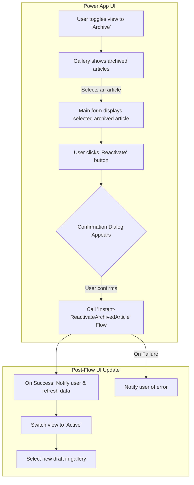

# Archive History Management

## Archive Viewer (UI)

### Overview

This document outlines the design for viewing and reactivating articles from the "Knowledge Base Articles Archive" list within the existing V2 application architecture. The goal is to provide a seamless user experience by integrating archive management directly into the main app interface, reusing existing components, and simplifying backend logic. This approach replaces the V1 design, which relied on separate screens and more complex flows.

### Core Principles

*   **UI/UX Consistency**: Integrate the archive view directly into the main user interface to provide a seamless experience. Avoid duplicating screens.
*   **Component Reuse**: Leverage existing galleries, forms, and controls to the greatest extent possible.
*   **Simplified Backend**: Consolidate all backend logic into a single, streamlined Power Automate flow.
*   **Maintainability**: Ensure the new functionality is easy to understand, maintain, and extend.

### Power App UI/UX Design

The archive functionality will be integrated directly into the main application screen.



### Main Screen Enhancements

To maintain a clean and responsive user interface, a single `Icon` control will be added to the header area of the main screen. This icon will function as a button to toggle the gallery's view between active and archived articles. This approach was chosen over a standard `Toggle` control to better align with the existing icon-based UI and prevent layout issues on smaller screen sizes.

*   **Controls**:
    *   **`ico_ArchiveView` (Icon)**:
        *   **Placement**: This icon should be placed in the header container (`con_galleryIconActions`) to the left of the existing filter (`ico_filter`) and refresh (`ico_refresh`) icons.
        *   **`Icon` Property**: The icon should be set to `Icon.History`. This icon was chosen as a clear visual metaphor for viewing historical or archived content, as a dedicated "Archive" icon is not available.
            ```powerapps
            Icon.History
            ```
        *   **`OnSelect` Property**: This formula toggles the boolean `locIsArchiveView` variable. This variable will be used throughout the app to determine which data source and UI elements to display.
            ```powerapps
            UpdateContext({ locIsArchiveView: !locIsArchiveView })
            ```
        *   **`Color` Property**: This formula provides critical visual feedback to the user, indicating which view is currently active. When the user is viewing the archive, the icon will be black. When viewing the active articles, it will be the brand's primary red color (`#e31717`).
            ```powerapps
            If(locIsArchiveView, Color.Black, ColorValue("#e31717"))
            ```
        *   **`Tooltip` Property**: A tooltip is provided to ensure the icon's function is clear to the user on hover. The text dynamically changes based on the current view.
            ```powerapps
            If(locIsArchiveView, "View Active Articles", "View Archived Articles")
            ```
    *   **`gal_Articles` (Main Gallery)**:
        *   **`Items` Property Modification**: The `Items` property will be updated to dynamically switch between the active and archive data sources based on the toggle's state.
            ```powerapps
            // The existing Filter/Sort/Search logic will be wrapped in a Switch function
            Switch(locIsArchiveView,
                true,
                // ARCHIVE VIEW: Point to the archive data source
                Filter('Knowledge Base Articles Archive', ...), // Apply same search/filter logic

                false,
                // ACTIVE VIEW: Point to the active data source (existing formula)
                Filter('Knowledge Base Articles', ...)
            )
            ```
    *   **`btn_Reactivate` (Button on Main Form)**:
        *   **`Text`**: `"Reactivate Article"`
        *   **`Visible` Property**: `locIsArchiveView && !IsBlank(gblSelectedItem)`
        *   **`OnSelect` Property**: This will trigger the generic confirmation dialog.
            ```powerapps
            UpdateContext({
                showConfirmationDialog: true,
                dialogTitle: "Reactivate Article",
                dialogMessage: "Are you sure you want to reactivate this article? This will move the article and its entire version history from the archive back to the active list as a new draft.",
                dialogContinueAction: "Reactivate",
                isReactivateAction: true // A new flag for the confirmation dialog
            })
            ```

### Confirmation Dialog Enhancement

The generic confirmation dialog's `OnSelect` property for the confirm button will be updated to handle the new `isReactivateAction` flag.

*   **`btn_dialogConfirm` `OnSelect` Property**:
    ```powerapps
    // ... existing If(isRevertAction, ...), If(isDiscardAction, ...) logic ...

    If(
        isReactivateAction,
        // --- Reactivate Article Action ---
        UpdateContext({
            locReactivateResult: 'Instant-ReactivateArchivedArticle'.Run(gblSelectedItem.CanonicalArticleID)
        });

        If(
            locReactivateResult.success,
            // --- SUCCESS PATH ---
            Notify("Article reactivated successfully. A new draft has been created.", NotificationType.Success);
            Refresh('Knowledge Base Articles');
            UpdateContext({ locIsArchiveView: false }); // Switch toggle back to Active
            Set(tgl_ViewToggle, true); // Visually reset the toggle
            // Look up the newly created draft and select it
            Set(
                gblSelectedItem,
                LookUp(
                    'Knowledge Base Articles',
                    CanonicalArticleID = gblSelectedItem.CanonicalArticleID && IsLatestVersion = true
                )
            );
            ResetForm(frm_ArticleContent);
            EditForm(frm_ArticleContent);,

            // --- FAILURE PATH ---
            Notify("Failed to reactivate article: " & locReactivateResult.message, NotificationType.Error)
        )
    );

    // ... existing code to hide dialog and reset flags ...
    UpdateContext({
        showConfirmationDialog: false,
        isProcessingAction: false,
        isRevertAction: false,
        isDiscardAction: false,
        isExpireAction: false,
        isReactivateAction: false // Reset the new flag
    });
    ```

## Backend Workflow

The backend logic for reactivating an article is handled by a dedicated Power Automate flow. This flow is responsible for the transactional process of moving all article versions, creating a new draft, and handling any potential errors.

For a complete, step-by-step implementation guide for the backend workflow, please see the [Instant - Reactivate Archived Article Design Doc](../../power-automate-flows/flow-designs/Instant_-_Reactivate_Archived_Article.md)**.

## Data Model Considerations

*   No schema changes are required. The logic relies on the existing columns in both the active and archive lists.

## Security and Permissions

*   **Flow Execution Context**: The Power Automate flow is configured to use a connection to SharePoint with a dedicated service account. Therefore, the flow executes with the permissions of the service account, not the user who triggers it from the app.
*   **User Permissions**: As long as a user is authorized to access and use the Power App, they will be able to perform the reactivate action. The underlying SharePoint permissions are handled by the service account, abstracting them away from the end-user.
