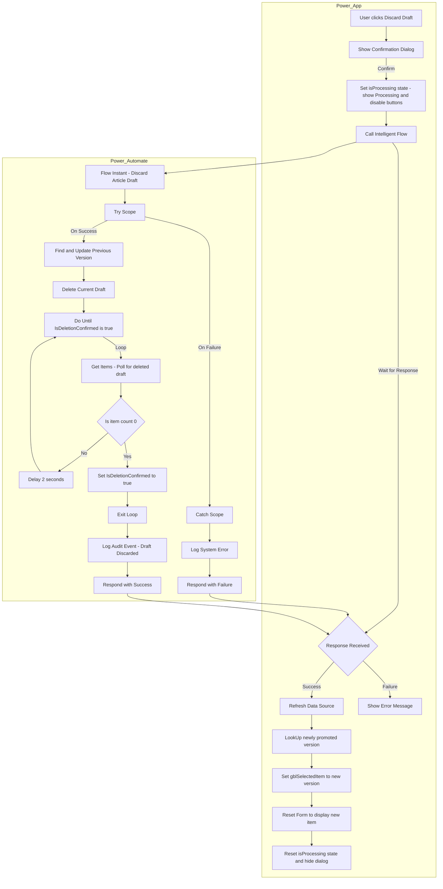

# Instant - Discard Article Draft

## Executive Summary

This document outlines the final, robust architecture for the "Discard Draft" feature. This feature allows an author or administrator to delete an unwanted draft version of an article, which automatically promotes the preceding version to become the new "latest" version.

Initial designs for this feature were unreliable due to a race condition caused by **SharePoint replication delay**. The backend would report a deletion as complete before the change had fully propagated, causing the Power App to fetch stale data and fail to update its UI.

The definitive solution moves the state-confirmation logic to the backend. The Power Automate flow (`Instant - Discard Article Draft`) now contains a **polling loop** that repeatedly queries SharePoint until it can definitively confirm the deletion is complete. Only then does it return a success message to the Power App. This makes the app's logic simple and reliable.

Furthermore, the UI has been enhanced to provide clear feedback during this process. When a user confirms the action, the dialog remains open, displays a "Processing..." message, and disables its buttons until the entire backend and frontend refresh operation is complete.

## The Core Problem: SharePoint Replication Delay

A fundamental challenge when interacting with SharePoint from Power Platform is that some operations, particularly deletions, are not truly instantaneous. There is a small but critical window of time between when SharePoint's API reports "Success" to the calling flow and when that change is fully replicated and visible across all subsequent API queries.

This creates a classic **race condition**:

1.  **Power App:** User clicks "Discard".
2.  **Power Automate:** The flow is called. It successfully runs the `Delete item` action.
3.  **Power Automate:** The flow immediately returns "Success" to the Power App.
4.  **Power App:** The app, now believing the deletion is complete, immediately calls `Refresh('Knowledge Base Articles')` to get the latest data.
5.  **The Race:** The `Refresh` command is often so fast that it queries SharePoint *before* the deletion has finished propagating. SharePoint, in its temporarily inconsistent state, returns a data set that still includes the "deleted" item.
6.  **The Failure:** The Power App's subsequent logic (`LookUp`, `Set gblSelectedItem`) runs against this stale data, fails to find the newly promoted version, and the UI remains stuck on the old, now-deleted draft.

## Final Architecture: Backend State Confirmation & Frontend Feedback

The final architecture uses a **backend polling pattern** combined with a **frontend processing state**.

1.  **Backend Polling:** The Power Automate flow is made responsible for guaranteeing the state of the database before it reports success. It performs the action and then enters a loop, repeatedly asking SharePoint, "Are you done yet?" until it gets the expected answer.
2.  **Frontend Processing State:** The Power App shows a "Processing..." message and disables the confirmation dialog's buttons while the backend flow is running. This prevents duplicate clicks and provides clear feedback to the user that their request is being handled.



## Power Automate Implementation: The Intelligent Flow

The `Instant - Discard Article Draft` flow must be modified to include the polling loop.

-   **Trigger:** `PowerApps (V2)`
-   **Inputs:**
    -   `draftItemID` (Number): The SharePoint ID of the draft item to be deleted.
    -   `canonicalID` (Text): The `CanonicalArticleID` of the article family.
    -   `draftVersion` (Number): The `ArticleVersion` of the draft being deleted.
    -   `modifiedBy` (Text): The UPN/email of the user performing the action. Passed from `User().Email` in the app.

---

### Detailed Flow Actions (Revised with Error Handling)

1.  **Initialize All Variables:** Add three `Initialize variable` actions at the start of the flow.
    *   **Action 1 (`responseStatus`):**
        *   **Name:** `responseStatus`
        *   **Type:** `String`
        *   **Value:** `Failed`
    *   **Action 2 (`responseMessage`):**
        *   **Name:** `responseMessage`
        *   **Type:** `String`
        *   **Value:** `An unknown error occurred while discarding the draft.`
    *   **Action 3 (`IsDeletionConfirmed`):**
        *   **Name:** `IsDeletionConfirmed`
        *   **Type:** `Boolean`
        *   **Value:** `false`

2.  **Try (Scope):** Add a `Try` scope to contain all core logic. All subsequent steps until the `Catch` block should be placed inside this scope.

3.  **Find Previous Version:** A `Get items` action to find the record that needs to be promoted.
    -   **Filter Query:** `CanonicalArticleID eq '[canonicalID]' and ArticleVersion eq @{sub(triggerBody()['number'], 1)}`

4.  **Condition: Only Update if Previous Version Exists:** Add a **Condition** control.
    -   **Purpose:** This is a critical step to prevent the flow from failing when discarding a Version 1 draft (which has no preceding version). It ensures the `Update item` action only runs if the "Find Previous Version" step actually returned a result.
    -   **Condition:** `length(outputs('Find_Previous_Version')?['body/value'])` is greater than `0`.
    -   **If Yes branch:**
        -   **4a. Update Previous Version:** Move the `Update item` action here.
            -   **ID:** Use the ID from the 'Find Previous Version' step: `first(outputs('Find_Previous_Version')?['body/value'])?['ID']`
            -   Set the `IsLatestVersion` column to `Yes`.
    -   **If No branch:** Leave this empty.

5.  **Delete Draft:** Place this action **after** the conditional block.
    -   **Action:** `Delete item`
    -   **ID:** Use the `draftItemID` from the trigger.

6.  **Do Until Loop:** Add a **Do until** control.
    -   Set it to run until: `IsDeletionConfirmed` is equal to `true`.

7.  **Inside the Loop - Poll SharePoint:** Add a **Get items** action.
    -   **Filter Query:** `CanonicalArticleID eq '@{triggerBody()['text_1']}' and ArticleVersion eq @{triggerBody()['number']}`
    -   **Top Count:** `1`

8.  **Inside the Loop - Check Condition:** Add a **Condition** control.
    -   **Condition:** `length(outputs('Poll_SharePoint')?['body/value'])` is equal to `0`
    -   **If Yes branch (Success Path):**
        -   **Action 1: Set Confirmation Flag**
            -   **Action:** `Set variable`
            -   **Name:** `IsDeletionConfirmed`
            -   **Value:** `true`
        -   **Action 2: Log Audit Event**
            -   **Action:** `Run a Child Flow`
            -   **Flow:** `Instant - LogAuditEvent`
            -   **Parameters (based on trigger schema):**
                -   `action` (Text): `Draft Discarded`
                -   `modifiedBy` (Text): `triggerBody()?['text_1']`
                -   `canonicalArticleId` (Text): `triggerBody()?['text']`
                -   `articleVersion` (Number): `triggerBody()?['number_1']`
                -   `details` (Text): `Concat('User discarded draft version ', triggerBody()?['number_1'], ' of article.')`
                -   `contentDiff` (Text): (leave blank)
        -   **Action 3: Set Success Response**
            -   **Action:** `Set variable`
            -   **Name:** `responseStatus`
            -   **Value:** `Success`
        -   **Action 4: Set Success Message**
            -   **Action:** `Set variable`
            -   **Name:** `responseMessage`
            -   **Value:** `The draft has been successfully discarded.`
    -   **If No branch:** Add a **Delay** action for 2 seconds.

9.  **Catch (Scope):** Add a `Catch` scope **after** the `Try` scope.
    *   **Configure run after:** Click the ellipsis (...) on the `Catch` scope and select "Configure run after". Check **only** the `has failed` box for the `Try` scope.
    *   **Inside the Catch Scope:**
        *   **Action 1: Set Failure Message**
            *   **Action:** `Set variable`
            *   **Name:** `responseMessage`
            *   **Value:** `An error occurred while discarding the draft. Please contact support. Error: @{result('Try')[0]?['error']?['message']}`
        *   **Action 2: Log System Error**
            *   **Action:** `Run a Child Flow`
            *   **Flow:** `Child Flow - LogSystemEvent`
            *   **Parameters (based on trigger schema):**
                *   `logLevel` (Text): `Error`
                -   `source` (Text): `Instant - Discard Article Draft`
                -   `message` (Text): `variables('responseMessage')`
                -   `context` (Text):
                    ```json
                    {
                      "draftItemID": "@{triggerBody()?['number']}",
                      "canonicalID": "@{triggerBody()?['text']}",
                      "draftVersion": "@{triggerBody()?['number_1']}",
                      "modifiedBy": "@{triggerBody()?['text_1']}"
                    }
                    ```

10. **Respond to Power App:** Add this action **after** the `Catch` scope.
    *   **Configure run after:** Click the ellipsis (...) and select "Configure run after". Check both the `is successful` and `is skipped` boxes for the `Catch` scope. This ensures this action runs regardless of whether the `Try` block succeeded or failed.
    *   **Action:** `Respond to a PowerApp or flow`
    *   **Outputs:**
        *   `status` (Text): `variables('responseStatus')`
        *   `message` (Text): `variables('responseMessage')`

## Power App Implementation

For details on the Power App UI, context variables, and the `OnSelect` formula that calls this flow, please see the central **[Reusable Confirmation Dialog documentation](../../power-app-design/power-app-features/GenericUIComponents.md)**.