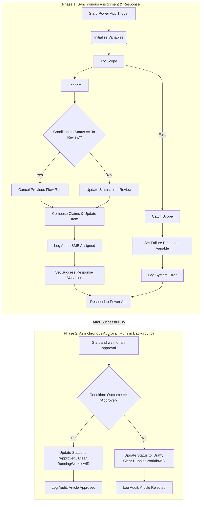

# Instant - Manage SME Approval (V2 - Decoupled Response)

## Overview

This document provides a complete, granular specification for the `Instant - Manage SME Approval` Power Automate workflow. This flow is a cornerstone of the event-driven approval architecture, triggered directly by the Power App to manage the approval lifecycle for a specific article.

This V2 design incorporates a critical architectural change based on established best practices: it **decouples the immediate response to the Power App from the long-running approval process**. The flow now uses a `Try/Catch` block to handle the initial synchronous assignment and immediately responds to the app, before starting the asynchronous approval task. This provides a more responsive and robust user experience, preventing the app from freezing while waiting for a lengthy background process.

### 1. Architectural Context

This workflow is a key component of the V3 decoupled application architecture. It is not a standalone process but is orchestrated and called directly by the main Power App when an SME is assigned to an article. For a complete understanding of how this flow integrates with the user interface and other backend processes, please see the central design document.

*   **Parent Document:** [`App Startup, Architecture, and UI Logic`](../../power-app-design/power-app-features/ScreenBreakdownAndLogic.md)

### 2. Architectural Pattern

1.  **Synchronous Assignment:** The flow immediately attempts to set the article's status and `RunningWorkflowID`. This includes handling re-assignments by canceling previous flow runs. This entire transaction is wrapped in a `Try` scope.
2.  **Immediate Feedback:** The flow instantly responds to the calling Power App with a structured JSON object containing a `responsestatus` (`Success` or `Failure`) and a `responsemessage`. This happens immediately after the `Try/Catch` block completes.
3.  **Asynchronous Approval:** Only if the initial assignment was successful, the flow proceeds to begin the long-running `Start and wait for an approval` process. This runs in the background, completely independent of the Power App's UI thread.

## Process Flow Diagram



## Detailed Implementation Steps

### 1. Trigger: PowerApps (V2)

*   **Type:** `PowerApps (V2)`
*   **Purpose:** To allow the Power App to initiate this workflow directly.
*   **Inputs:**
    *   `ItemID` (Type: Number, Required): The unique SharePoint list item ID for the article.
    *   `smeEmail` (Type: String, Required): The email address of the new SME to be assigned.
    *   `appURL` (Type: String, Required): The base URL of the Power App.
    *   `modifiedBy` (Type: String, Required): The UPN/email of the user performing the assignment.

### 2. Initialize Variables

These actions must be placed immediately after the trigger.

*   **Action 1: Initialize `responseStatus`**
    *   **Name:** `Initialize_responseStatus`
    *   **Type:** `String`
    *   **Value:** `Failure`
*   **Action 2: Initialize `responseMessage`**
    *   **Name:** `Initialize_responseMessage`
    *   **Type:** `String`
    *   **Value:** `An unknown error occurred during the SME assignment process.`

### 3. Try (Scope)

This scope contains the core synchronous logic that must execute immediately.

#### 3.1. Get Article Properties

*   **Action:** `Get item` (SharePoint)
*   **Name:** `Get_item`
*   **Purpose:** To retrieve all current properties for the specified article.
*   **Configuration:**
    *   **Site Address:** `(kmt_KnowledgeManagementSharePointSiteURL)` (Environment Variable)
    *   **List Name:** `(kmt_KnowledgeManagementKBArticlesListName)` (Environment Variable)
    *   **Id:** `@triggerBody()?['number']`

#### 3.2. Condition: Check if Re-Assignment is Needed

*   **Action:** `Condition`
*   **Name:** `Condition_Check_if_Re-Assignment_is_Needed`
*   **Purpose:** To determine if this is an initial assignment or a re-assignment.
*   **Configuration:**
    *   **Condition:** `Status` (from `Get_item` output) `is equal to` `In Review`
    *   **Expression:** `@equals(outputs('Get_item')?['body/field_4/Value'], 'In Review')`

##### If Yes: Re-Assignment Path

*   **Action:** `Cancel Flow Run` (Power Automate Management)
*   **Name:** `Cancel_Previous_Approval_Flow`
*   **Purpose:** To terminate the previously running instance of this workflow.
*   **Configuration:**
    *   **Environment:** `@workflow()?['tags']?['environmentName']`
    *   **Flow:** The unique identifier of this same workflow (`Instant - Manage SME Approval`).
    *   **Run ID:** `@outputs('Get_item')?['body/RunningWorkflowID']`

##### If No: Initial Assignment Path

*   **Action:** `Update item` (SharePoint)
*   **Name:** `Update_Status_to_In_Review`
*   **Purpose:** To mark the article as being in the review process.
*   **Configuration:**
    *   **Id:** `@outputs('Get_item')?['body/ID']`
    *   **Status (`field_4`):** `In Review`

#### 3.3. Compose SME Claims String

*   **Action:** `Compose`
*   **Name:** `Compose_SME_Claims_String`
*   **Purpose:** To construct the required claims token for updating a SharePoint Person field.
*   **Inputs:** `concat('i:0#.f|membership|', triggerBody()?['text'])`

#### 3.4. Update SME and Set Running Workflow ID

*   **Action:** `Update item` (SharePoint)
*   **Name:** `Update_SME_and_Set_RunningWorkflowID`
*   **Purpose:** To assign the new SME and simultaneously store the unique run ID of this current workflow instance onto the SharePoint item.
*   **Configuration:**
    *   **Id:** `@outputs('Get_item')?['body/ID']`
    *   **Assigned SME Claims:** `outputs('Compose_SME_Claims_String')`
    *   **AssignedSMEEmail:** `@triggerBody()?['text']`
    *   **RunningWorkflowID:** `@workflow()?['run']?['name']`
    *   **ReminderTimestamp:** `@utcNow()`

#### 3.5. Log SME Assignment

*   **Action:** `Run a Child Flow`
*   **Flow:** `Instant - LogAuditEvent`
*   **Parameters:**
    *   `action` (Text): `SME Assigned`
    *   `modifiedBy` (Text): `triggerBody()?['text_2']`
    *   `canonicalArticleId` (Text): `outputs('Get_item')?['body/CanonicalArticleID']`
    *   `articleVersion` (Number): `outputs('Get_item')?['body/ArticleVersion']`
    *   `details` (Text): `Concat('User assigned SME ', triggerBody()?['text'], ' to article.')`
    *   `contentDiff` (Text): (leave blank)

#### 3.6. Set Success Response Variables

*   **Action 1: Set `responseStatus`**
    *   **Name:** `Set_variable_responseStatus_to_Success`
    *   **Value:** `Success`
*   **Action 2: Set `responseMessage`**
    *   **Name:** `Set_variable_responseMessage_to_Success`
    *   **Value:** `SME assignment was successful. The approval process has been initiated.`

### 4. Catch (Scope)

*   **Configure run after:** Click the ellipsis (...) on the `Catch` scope and select "Configure run after". Check **only** the `has failed` box for the `Try` scope.
*   **Inside the Catch Scope:**
    *   **Action 1: Set Failure Message**
        *   **Action:** `Set variable`
        *   **Name:** `Set_variable_responseMessage_on_Failure`
        *   **Value:** `An error occurred while assigning the SME. Please contact support. Error: @{result('Try')[0]?['error']?['message']}`
    *   **Action 2: Log System Error**
        *   **Action:** `Run a Child Flow`
        *   **Flow:** `Child Flow - LogSystemEvent`
        *   **Parameters (Standardized Schema):**
            *   `logLevel` (Text): `Error`
            *   `source` (Text): `Instant - Manage SME Approval`
            *   `message` (Text): `variables('responseMessage')`
            *   `context` (Text):
                ```json
                {
                  "ItemID": "@{triggerBody()?['number']}",
                  "smeEmail": "@{triggerBody()?['text']}",
                  "appURL": "@{triggerBody()?['text_1']}",
                  "modifiedBy": "@{triggerBody()?['text_2']}"
                }
                ```

### 5. Respond to Power App

*   **Configure run after:** Check the boxes for `is successful`, `has failed`, `is skipped`, and `has timed out` for the `Catch` scope. This ensures this action runs regardless of whether the `Try` block succeeded or failed.
*   **Action:** `Respond to a PowerApp or flow`
*   **Outputs:**
    *   `responsestatus` (Text): `variables('responseStatus')`
    *   `responsemessage` (Text): `variables('responseMessage')`

### 6. Asynchronous Approval Process (Wrapped in Try/Catch)

This entire section runs in the background and is wrapped in its own Try/Catch block to handle failures during the long-running approval.

#### 6.1. Try (Asynchronous)

*   **Configure run after:** Check **only** the `is skipped` box for the `Catch` scope (the synchronous one).
*   **Inside this Try scope, place the following actions:**
    *   **Action: `Start and wait for an approval`**
        *   **Action:** `Start and wait for an approval` (Approvals)
        *   **Name:** `Start_and_wait_for_SME_approval`
        *   **Configuration:**
            *   **Approval type:** `Approve/Reject - First to respond`
            *   **Title:** `KB Article Review Request: @{outputs('Get_item')?['body/Title']}`
            *   **Assigned to:** `@triggerBody()?['text']`
            *   **Item link:** `@concat(triggerBody()?['text_1'], '&tenantId=3e04753a-ae5b-42d4-a86d-d6f05460f9e4&ArticleID=', outputs('Get_item')?['body/field_3'])`
            *   **Item link description:** `Click here to view the article in the Power App`

    *   **Action: `Condition: Check Approval Outcome`**
        *   **Action:** `Condition`
        *   **Name:** `Condition_Check_Approval_Outcome`
        *   **Configuration:**
            *   **Condition:** `Outcome` (from `Start_and_wait_for_SME_approval` output) `is equal to` `Approve`

        *   **If Yes: Approval Path**
            *   **Action:** `Update item` (SharePoint)
            *   **Name:** `Update_Status_to_Approved`
            *   **Configuration:**
                *   **Id:** `@outputs('Get_item')?['body/ID']`
                *   **Status (`field_4`):** `Approved`
                *   **ApprovedDate:** `@utcNow()`
                *   **Review Comments (`field_10`):** `@outputs('Start_and_wait_for_SME_approval')?['body/responses']?[0]?['comments']`
                *   **RunningWorkflowID:** `null` (Set using an expression)
                *   **ReminderTimestamp:** `null` (Set using an expression)
            *   **Action: Log Approval Event**
                *   **Action:** `Run a Child Flow`
                *   **Flow:** `Instant - LogAuditEvent`
                *   **Parameters:**
                    *   `action` (Text): `Article Approved`
                    *   `modifiedBy` (Text): `outputs('Start_and_wait_for_SME_approval')?['body/responder/email']`
                    *   `canonicalArticleId` (Text): `outputs('Get_item')?['body/CanonicalArticleID']`
                    *   `articleVersion` (Number): `outputs('Get_item')?['body/ArticleVersion']`
                    *   `details` (Text): `Concat('SME approved the article. Comments: ', outputs('Start_and_wait_for_SME_approval')?['body/responses']?[0]?['comments'])`
                    *   `contentDiff` (Text): (leave blank)

        *   **If No: Rejection Path**
            *   **Action:** `Update item` (SharePoint)
            *   **Name:** `Update_Status_to_Draft`
            *   **Configuration:**
                *   **Id:** `@outputs('Get_item')?['body/ID']`
                *   **Status (`field_4`):** `Draft`
                *   **Review Comments (`field_10`):** `@outputs('Start_and_wait_for_SME_approval')?['body/responses']?[0]?['comments']`
                *   **RunningWorkflowID:** `null` (Set using an expression)
                *   **ReminderTimestamp:** `null` (Set using an expression)
            *   **Action: Log Rejection Event**
                *   **Action:** `Run a Child Flow`
                *   **Flow:** `Instant - LogAuditEvent`
                *   **Parameters:**
                    *   `action` (Text): `Article Rejected`
                    *   `modifiedBy` (Text): `outputs('Start_and_wait_for_SME_approval')?['body/responder/email']`
                    *   `canonicalArticleId` (Text): `outputs('Get_item')?['body/CanonicalArticleID']`
                    *   `articleVersion` (Number): `outputs('Get_item')?['body/ArticleVersion']`
                    *   `details` (Text): `Concat('SME rejected the article. Comments: ', outputs('Start_and_wait_for_SME_approval')?['body/responses']?[0]?['comments'])`
                    *   `contentDiff` (Text): (leave blank)

#### 6.2. Catch (Asynchronous)

*   **Configure run after:** Check **only** the `has failed` box for the `Try (Asynchronous)` scope.
*   **Inside this Catch scope, place the following actions:**
    *   **Action 1: Log System Error**
        *   **Action:** `Run a Child Flow`
        *   **Flow:** `Child Flow - LogSystemEvent`
        *   **Parameters (Standardized Schema):**
            *   `logLevel` (Text): `Error`
            *   `source` (Text): `Instant - Manage SME Approval (Async)`
            *   `message` (Text): `An error occurred during the asynchronous approval process. Error: @{result('Try_(Asynchronous)')[0]?['error']?['message']}`
            *   `context` (Text):
                ```json
                {
                  "ItemID": "@{triggerBody()?['number']}",
                  "smeEmail": "@{triggerBody()?['text']}",
                  "appURL": "@{triggerBody()?['text_1']}",
                  "modifiedBy": "@{triggerBody()?['text_2']}"
                }
                ```
    *   **Action 2: Unlock Article**
        *   **Action:** `Update item` (SharePoint)
        *   **Name:** `Unlock_Article_on_Async_Failure`
        *   **Configuration:**
            *   **Id:** `@outputs('Get_item')?['body/ID']`
            *   **RunningWorkflowID:** `null` (Set using an expression)
            *   **ReminderTimestamp:** `null` (Set using an expression)